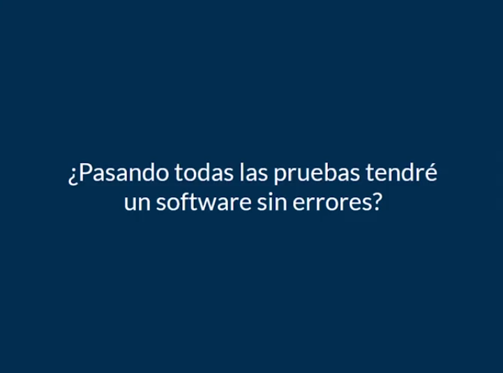
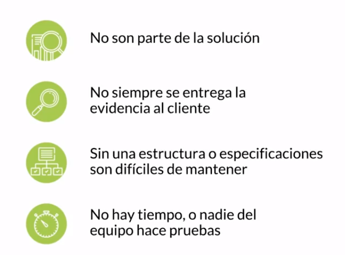
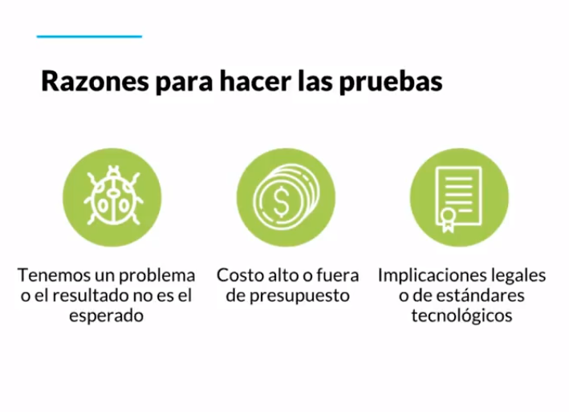

[🔙 << Clase 1](../01_Class_Introduction/01_Introduction.md) | [Clase 3 >>](../03_Class/03_Class.md)

[🔙 Volver](../README.md)

# Clase 2: ¿Qué son las pruebas y por qué deberíamos hacerlas?

¿Cuántas veces hemos sido usuarios de alguna app móvil y ha fallado? ¿Cuántas veces hemos estado involucrados en el desarrollo de un producto y hemos experimentado retrabajo debido a las fallas o defectos que contiene?

Muchas veces, una mala experiencia del usuario con un software, una aplicación o un producto puede hacer que deje de utilizarse.

### ¿Qué son las pruebas?

Las pruebas son el proceso de evaluar un producto a través de la exploración y la experimentación. Esto implica cuestionar, estudiar, modelar, observar, inferir, verificar la salida de datos, entre otros aspectos.

Es importante entender completamente el producto que estás desarrollando para evitar que los defectos y errores se conviertan en retrabajo y se multipliquen como una bola de nieve. Las pruebas te permiten explorar, experimentar y comprender el producto. Puedes realizar pruebas por cuestiones de costo, prestigio o requisitos legales.

Siempre existe un cierto grado de incertidumbre y la posibilidad de que se produzcan errores, incluso en un porcentaje muy bajo, especialmente con la implementación de nuevas tecnologías. Por lo tanto, es necesario actualizar y optimizar las pruebas en algún momento.

Tres aspectos a considerar:

Es fundamental estimar correctamente, comprender completamente el producto, conocer al cliente y mantener una comunicación efectiva con el equipo de desarrollo en los diferentes niveles y subniveles. Esto evita recurrir a reprocesos y permite un trabajo armonioso y adecuado, evitando apagar incendios constantemente.

¡FELICIDADES! 🎉

[🔙 << Clase 1](../01_Class_Introduction/01_Introduction.md) | [Clase 3 >>](../03_Class/03_Class.md)
