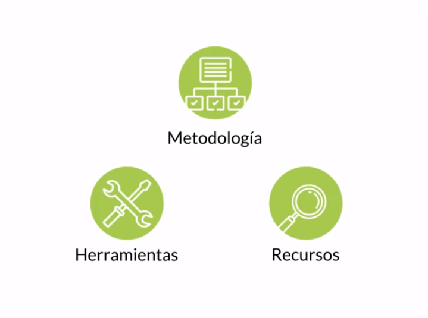
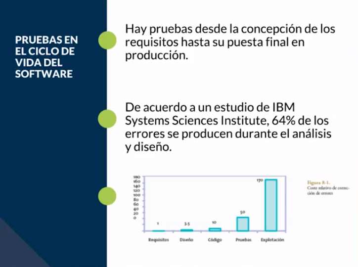
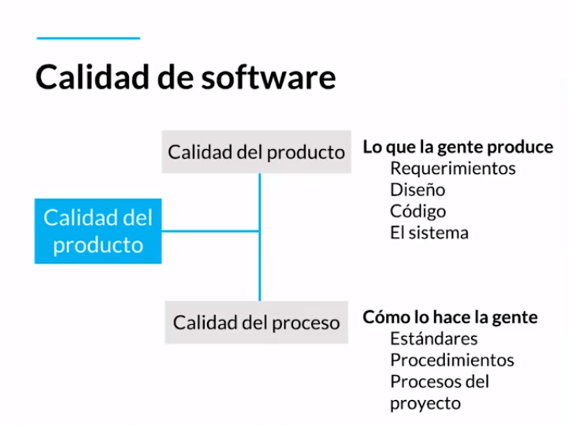
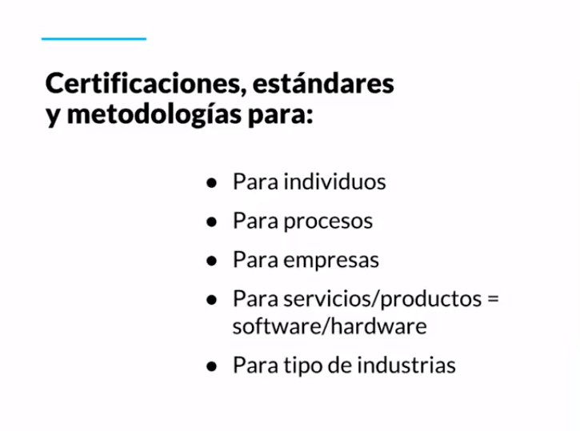
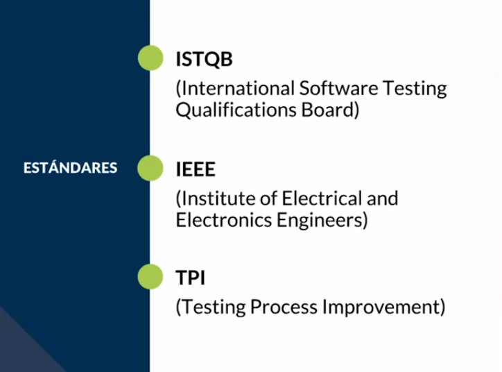

[🔙 << Clase 2](../02_Class/02_Class.md) | [Clase 4 >>](../04_Class/04_Class.md)

[🔙 Volver](../README.md)

# Clase 3 Proceso de pruebas del software y los estándares internacionales

### Etapas del desarrollo de software

- Que es Metodologia 

Es la parte en donde se establecen criterios o estrategias de como se va a llevar a cabo las pruebas, quien es el responsable, como se debe entregar el material, Etc.

- Recursos

Aunque se quieran hacer pruebas y no se esta preparado con el tiempo esas carencias se van a mostrar como defectos

- Herramientas

Contar con las herramientas adecuadas permiten de alguna forma acelerar el trabajo como tester en cuanto a la identificacion de problemas, documentación y comunicación

Es necesario tener muy bien definidas estas etapas para evitar re-procesos y que todo el equipo entienda la finalidad del mismo 

### Revision de las pruebas

- Definir la falta de calidad del equipo

- Detectar y corregir la falta de calidad

- Calidad del proceso

- Verificar especificaciones y necesidades del cliente

Las certificaciones pueden ser aplicadas a cualquier tipo de industria, automotriz, farmaceutica, ventas, salud, personas y empresas en general

y cada una de este tipo de industrias lleva diferentes tipos de pruebas 

No solo se deben implementar certificaciones en las empresas porque muchas veces esto no significa que cumplan con los estandares de calidad, se debe velar por cumplir y mantener estandares que promuevan el buen desarrollo de la empresa

🎉 CONGRATULATIONS ! 🎉

[🔙 << Clase 2](../02_Class/02_Class.md) | [Clase 4 >>](../04_Class/04_Class.md)