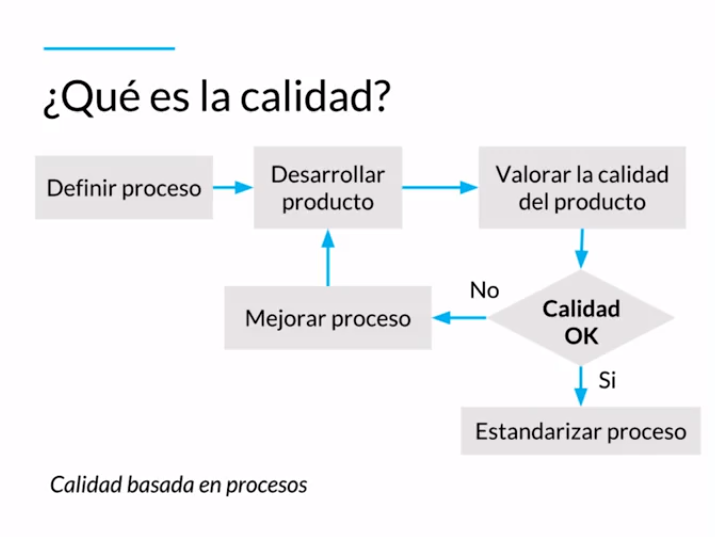
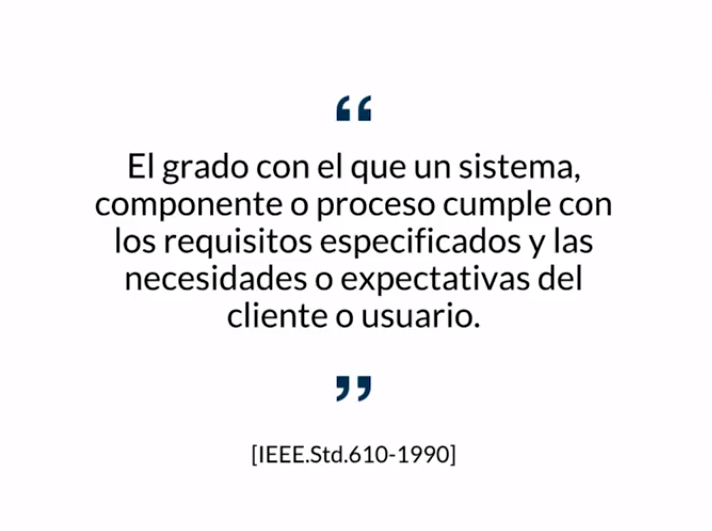
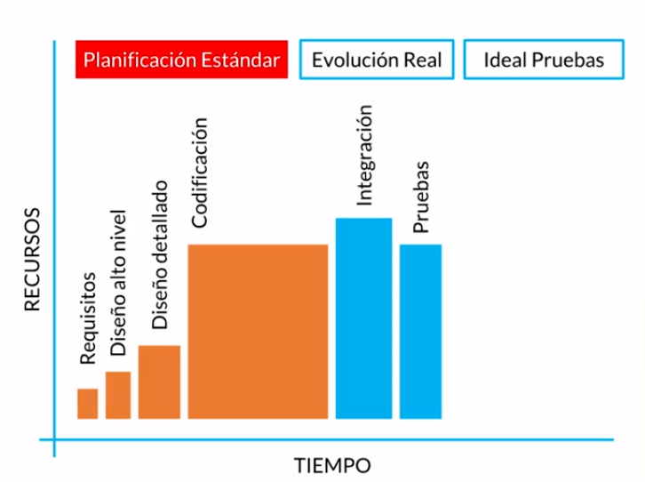
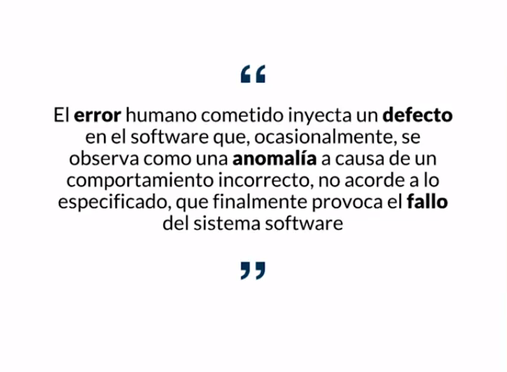

[🔙 << Clase 4](../04_Class/04_Class.md) | [Clase 6 >>](../06_Class/06_Class.md)

[🔙 Volver](../README.md)

## Clase 5 Proceso de pruebas del software: Calidad y Defectos

La calidad es una percepción entre lo deseado, analizado y lo que vamos a entregar. La calidad la define el cliente, si esa persona esta satisfecha con lo entregado hasta ahí llega la calidad.

Los estandares de la IEEE(Insitute of Electrical and Electronics Engineers) (Instituto de Ingenieros Eléctricos y Electrónicos) asociación técnico-profesional mundial dedicada a la estandarización, entre otras cosas. Es la mayor asociación internacional, sin ánimo de lucro, formada por profesionales de las nuevas tecnologías.) forman parte de la documentacion y es la manera en la que define el cumplimiento de requisitos, necesidades o expectativas del cliente

Se hace enfasis en el entendimiento y necesidades del cliente. Si los procesos de pruebas de software no son eficientes, en cada una de las fases va a empezar a haber defectos

Dentro de las etapas existe una planificacion estandar que van a variar respecto a necesidades y tiempo del proyecto

- **Verificación:** Es ir en cada etapa revisando que se cumpla lo propuesto por el cliente.

- **Validación:** Antes de entregar al cliente, validamos que efectivamente el conjunto de requerimientos esta siendo cumplido con lo entregado.

- **Anomalía:** Cualquier condición insatisfactoria

- **Defecto:** Un problema que se reproduce una y otra vez, no desempeña funciones

- **Fallo:** Pueden ser situaciones no asociadas al software desarrollado, incapacidad dentro de márgenes

- **Error:** Acción humana incorrecta

[🔙 << Clase 4](../04_Class/04_Class.md) | [Clase 6 >>](../06_Class/06_Class.md)