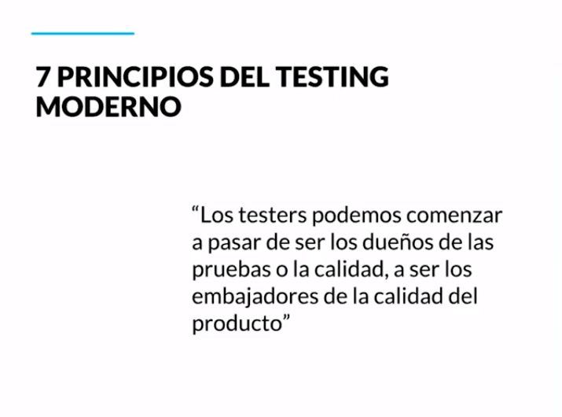
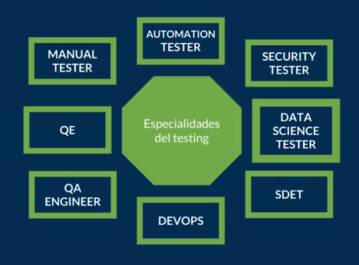

[🔙 << Clase 5](../05_Class/05_Class.md) | [Clase 7 >>](../07_Class/07_Class.md)

[🔙 Volver](../README.md) 

## Clase 6 Principios del testing moderno

Los principios creados por Ellen Page y Brian Jensen es acerca del testing moderno que es la evolucion natural del testing agil

El desarrollo de este principio es la necesidad de que el tester y el desarrollador evoluciones en su perspectiva para que ambos trabajen como un equipo y no como dos entidades separadas

El tester deberia enfocarse en la calidad del producto, proceso (calidad de software)

El desarrollador deberia enfocarse en desarrollar la aplicacion

El tester podria ayudar a mejorar a encontrar las mejores herramientas a entender los procesos de prueba y mejorar la calidad del desarollo 

1. Nuestra prioridad es mejorar el negocio: El producto que se va a entregar al cliente permitirá hacer funcionar el negocio. Si en algún momento no quieres hacerlo, estás poniendo en riesgo ese negocio porque si el producto no se vende o no es aceptado la empresa puede cerrar o puedes perder el trabajo.

2. Nosotros aceleramos el equipo y usamos modelos como Lean Thinking y Teoría de las Restricciones para ayudar a identificar, priorizar y mitigar cuellos de botella en el sistema: Cuando queremos hacer algo, lo queremos hacer perfecto y eso puede ser demasiado. Deberías construir en base a procesos cortos para poder encontrar los defectos de una manera más rápida.

3. Nosotros somos la fuerza para la mejora continua, ayudando al equipo a adaptarse y optimizar para tener éxito, en lugar de proporcionar una red de seguridad para detectar fallas: El cliente puede entender que el producto se va a liberar por fases, es importante que nosotros enfoquemos nuestras pruebas en cada una de esas fases. No tiene que ser todo al inicio y al final, debe haber una distribución que nos permita manejar el riesgo del software

4. Nos preocupamos profundamente acerca de la cultura de calidad en nuestro equipo, y asesoramos, lideramos y nutrimos el equipo para llevarlos a una cultura de calidad más madura: Al inicio los testers eran personas desarrollando software y un día con tantos defectos y trabajo, separaron los roles para que así hubiese una persona dedicada a realizar las pruebas. El tester puede hacer recomendaciones de herramientas, mejorar el proceso o volverse un coach.

5. Nosotros creemos que el cliente es el único capaz de juzgar y evaluar la calidad de nuestro producto: Si el cliente esta satisfecho con lo entregado y cumple las expectativas entonces has alcanzado la calidad deseada.

6. Nosotros usamos datos de manera extensa y profunda para entender los casos de uso del cliente y entonces cerrar huecos entre hipótesis del producto e impacto del negocio.

7. Expandimos las habilidades de testing y el conocimiento en todo el equipo; entendemos que esto reduce o elimina la necesidad de una especialista dedicado al testing.

[🔙 << Clase 5](../05_Class/05_Class.md) | [Clase 7 >>](../07_Class/07_Class.md)

