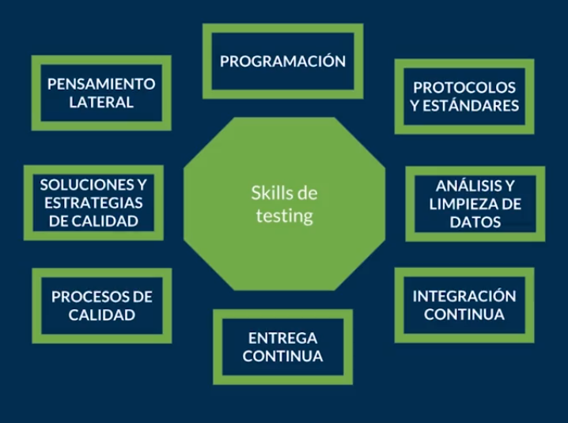

[🔙 << Clase 6](../06_Class/06_Class.md) | [Clase 8 >>](../08_Class/08_Class.md)

[🔙 Volver](../README.md)

## Clase 7 Especialidades del testing

### Manual tester:

Nos ayuda a definir los casos de pruebas, establecer estrategias. También ejecuta, pero lleva lo necesario para que todos sepan qué hacer.

Pensamiento lateral, piensa fuera de la caja con una nueva perspectiva, agrega nuevos casos de usos y entiende muy bien al usuario.

### Automation tester: 

Se encarga de agilizar, acelerar el trabajo y actividades que nos quitan la oportunidad de encontrar más casos de usos.

Conoce de programación, no solo de forma básica, debe conocer como crear diseños de frameworks y soluciones. El código crece y las pruebas también, darle ese mantenimiento a las pruebas es un problema común.

### Security tester: 

Encargado para el área de seguridad. Debe ser alguien que aporte valor desde la perspectiva de la seguridad.

Protocolos, estándares, legalizaciones dependiendo de cada país y marca. Esta enfocado en prever ataques, virus, problemas de seguridad, acceso no autorizado. Profundizar en las técnicas y prácticas de seguridad.

### Data science tester: 

Con la manera en que crecen los datos en un proyecto, se necesita a alguien que los analice, agrupe y limpie estos datos.

Análisis y Limpieza de datos, omite tener un set de pruebas amplio donde la variedad va a permitir detectar defectos inesperados. Esto puede ser clave para que los resultados no sean falsos positivos

### SDET: 

Es la combinacion de un desarrollador que ya sabe hacer pruebas. Con la diferencia de automatiza y hace uso de herramientas que organizan la operación de la entrega de las pruebas. Esta persona se asegura de que las pruebas se ejecuten antes de liberar el código.

El programador ahora sabe hacer pruebas y conoce de herramientas que le permite entregarlas de una manera automatizada.

### DevOps: 

Conoce todo lo anterior y domina el conocimiento de automatizar el proceso, se asegura de una entrega continua.

Una automatización de la operación, Entrega Continua. Donde se entregan de forma más rápida las nuevas versiones.

### QA Engineer: 

Quality Assurance. Esta enfocado en el producto y en el proceso.

Procesos de Calidad

### QE: 

Quality Engineer. Es como un coach, acompaña en las politicas de calidad en la empresa o equipo.

Soluciones de estrategias de calidad.

### Habilidades dentro de las especialidades del testing 

[🔙 << Clase 6](../06_Class/06_Class.md) | [Clase 8 >>](../08_Class/08_Class.md)
