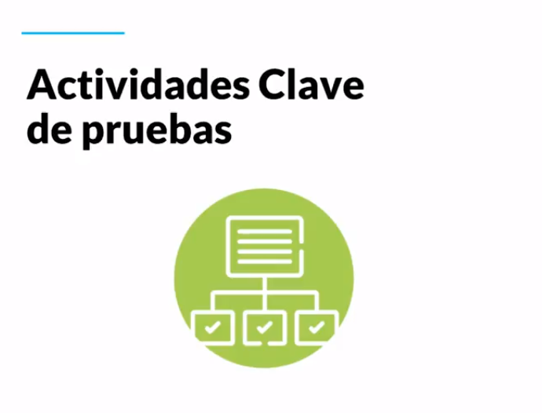

[🔙 << Clase 7](../07_Class/07_Class.md) | [Clase 9 >>](../09_Class/09_Class.md)

[🔙 Volver](../README.md)

## Clase 8 Presupuesto, Recursos, Tiempo y Actividades Clave

Elementos para crear un proyecto de software tienen que ver con el presupuesto, recursos y tiempos

Si un proyecto no tiene suficiente dinero para tener el equipo necesario de personas e infraestructura no se va a poder llevar a cabo

Si no se cuenta con el equipo de recurso humano ideal e idoneo con el conocimiento el proyecto peude que no se lleve a cabo o por lo menos puede pasar que no se cumpla el tiempo estimado del mismo

Los costos tambien pueden llegar a incrementar

## Etapa de Analisis

- Revision con el cliente y equipo

- Documentacion

- Pruebas de requerimientos del cliente

- Alcance y necesidad del cliente y como puedo empezar a abordar los problemas que se puedan llegar a aparecer por mas ambiguos que sean y tambien como voy a confirmar que un requerimiento se cumpla

## Etapa de Diseño

- Criterios visuales que espera el cliente

- Que espera en la funcionalidad combinado con el diseño del producto

- Alertas del producto al hacer check de manera correcta o incorrecta

## Etapa de codigo

- Revision e implementacion de modulos, funciones o bases de datos

- Verificacion de lo que esta en el backend y en lo posible si existe el Frontend

- Revision de las mejores practicas para la implementacion y desarrollo del software

## Etapa de pruebas

- Pruebas de transmision de datos en distintos dispositivos

- Confirmacion de los requerimientos del cliente a traves de la validacion y verificacion

- Pruebas de aceptacion donde el usuario final acepta el producto requerido pero se debe tener que cuenta que antes de entregar al cliente final se tuvieron que haber hecho todas las pruebas posibles en las anteriores etapas

[🔙 << Clase 7](../07_Class/07_Class.md) | [Clase 9 >>](../09_Class/09_Class.md)