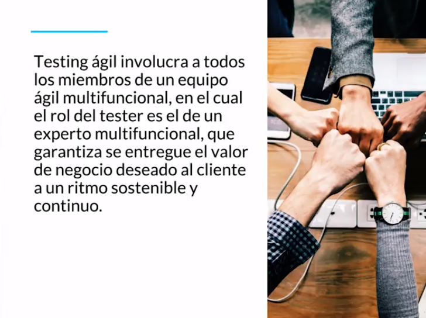

[🔙 << Clase 10](../10_Class/10_Class.md) | [Clase 12 >>](../12_Class/12_Class.md)

[🔙 Volver](../README.md)

## Clase 11 Testing ágil

Involucra a todos, no solo el tester, todos en el equipo son tester. La persona con este rol se aseguran de la mayor cobertura de pruebas tomando en cuenta todas las necesidades que cada uno de los miembros del equipo también esta intentando hacer que funcione. El tester tiene que definir si se esta cumpliendo con los requerimientos funciones y los del equipo, al final, sera el apoyo que dara dando retroalimentacion y viendo como puede dar funcionalidad para tener finalmente un proyecto o servicio optimo.

### Estrategias Ágiles:

- El testing es de “todo el equipo”

- El testing puede ser independiente

- Integración continua

- Testing guiado por pruebas (Test Driven Development)

- Desarrollo guiado por comportamiento (Behaviour Driven Development)

- Desarrollo guiado por las pruebas de aceptación (Acceptance Test Driven Development)

La finalidad de este es que entre todos puedan pensar como hacer pruebas teniendo distintos entornos y ambientes que se puedan llegar a presentar en una aplicacion cualquier contando con los detalles mas minimos para que el producto tenga todas las caracteristicas donde si hay un sesgo de error no se note con la funcionalidad del producto.

🎉 CONGRATULATIONS ! 🎉

[🔙 << Clase 10](../10_Class/10_Class.md) | [Clase 12 >>](../12_Class/12_Class.md)

