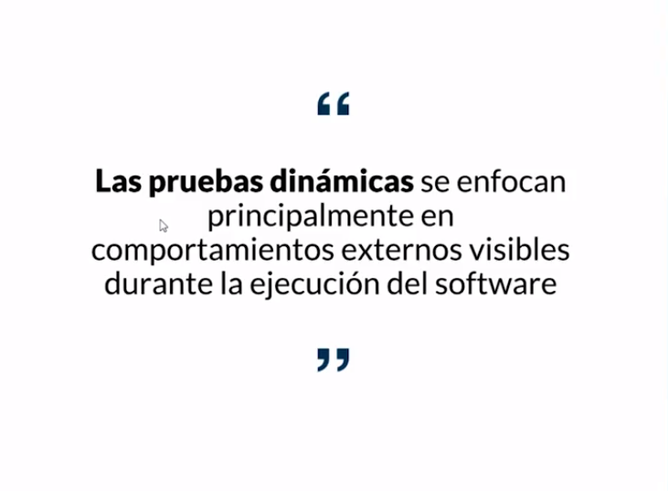
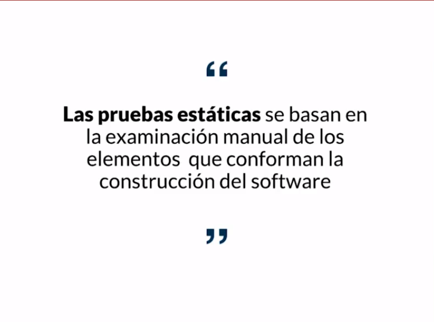
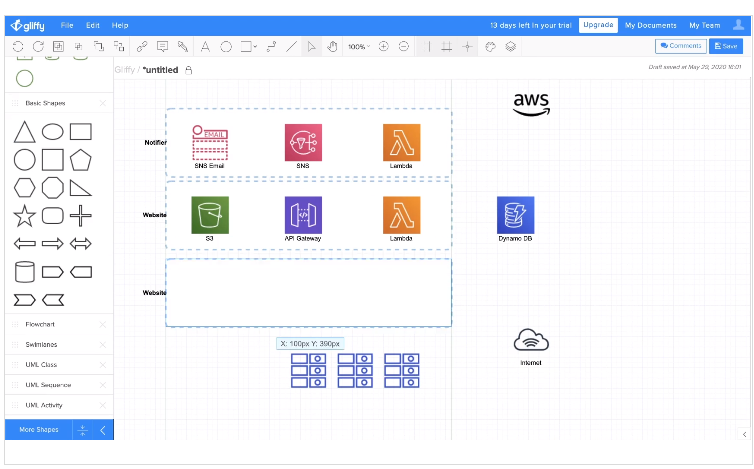
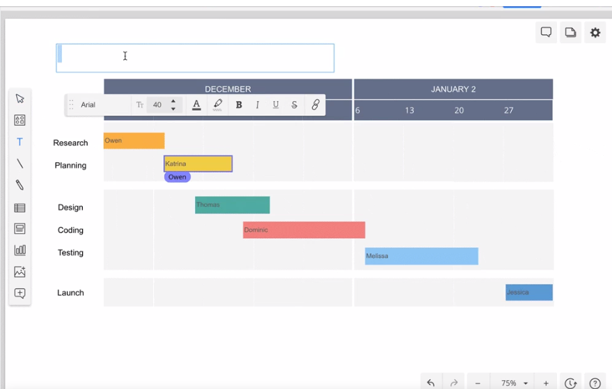
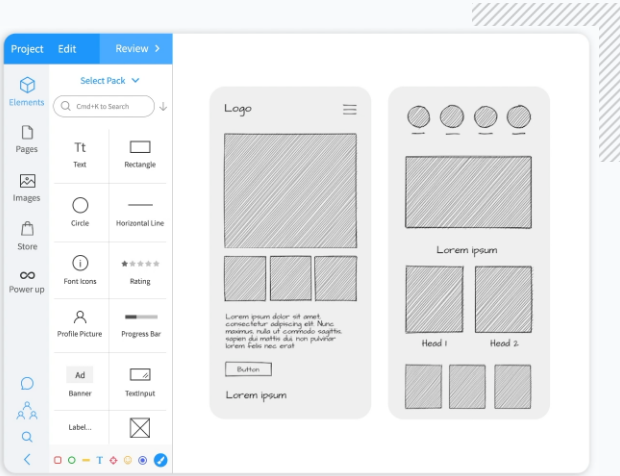
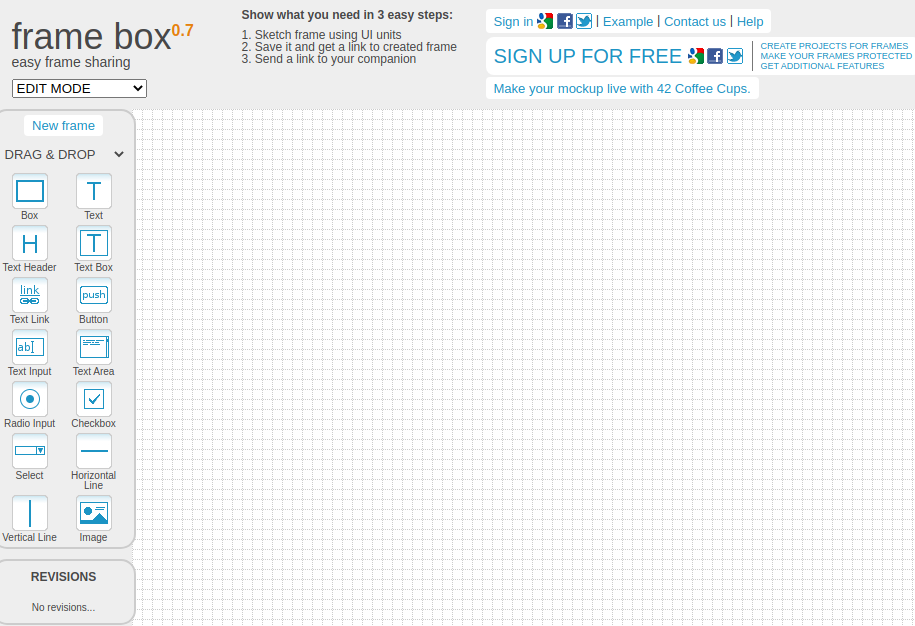
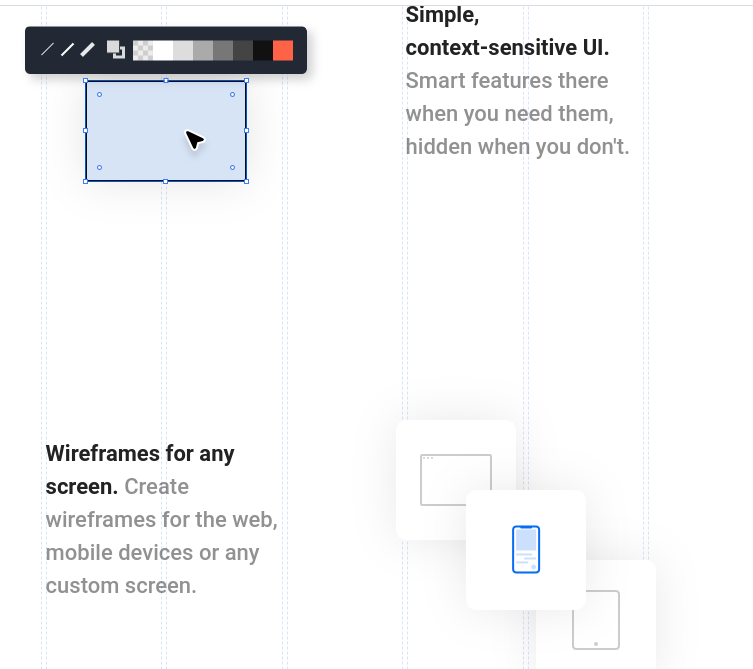

[🔙 << Clase 13](../13_Class/13_Class.md) | [Clase 15 >>](../15_Class/15_Class.md)

[🔙 Volver](../README.md)

## Clase 14 Pruebas estáticas y dinámicas

Generalmente se espera que el tester siempre este ejecutando pruebas pero muchas veces, las pruebas estaticas no son consideradas durante el desarrollo porque este tipo de pruebas incluyen que se este leyendo documentación, analizando software, comparando, haciendo un planteamiento diseñando el plan de pruebas

### ¿Qué son los elementos?

- Contratos, planes y calendario del proyecto, asi como su presupuesto.

- El análisis de requerimientos

- Especificaciones o regras de negocio

    - Tecnicos

    - Seguridad 

Es cuestionar que elementos a lo mejor no esta incluyendo el cliente y el tester esta para preguntar qué, como, de que manera, debe hacer el desarrollador para incluir elementos que no se estan especificando en un principio pero que van a ser necesarios en la funcionalidad del producto que esta solicitando el cliente 

- Las definiciones de 

    - Historias del usuario

    - Criterios de aceptacion

    - Mockups

- El diseño de la arquitectura

- Las pruebas (Testware), puntos de verificacion, (Pruebas clave)

- Guias de usuario

- Evaluación/revisión del código

### Beneficios

- Detectar y corregir defectos de manera más eficiente

- Identificar y priorizar la ejecución de pruebas en etapas posteriores

- Prevenir defectos

    - Que no son fácilmente detedectables durante las pruebas dinámicas

    - Durante la etapa de análisis y diseño

- Cubrir aspectos como:

    - Inconsistencias, ambigûedades, contradicciones, definiciones inexactas, requerimientos redundantes

- Reducir el retrabajo e incrementar la productividad

- Reducir el costo y el tiempo

- Mejorando la comunicación entre todos los miembros del equipo

### Herramientas para realizar mockups

- Gliffy https://www.gliffy.com/

- Cacoo https://cacoo.com/

- Mockflow https://www.mockflow.com/

- Frame Box http://framebox.org/

- Wireframe cc https://wireframe.cc/ 

🎉 CONGRATULATIONS ! 🎉

[🔙 << Clase 13](../13_Class/13_Class.md) | [Clase 15 >>](../15_Class/15_Class.md)

