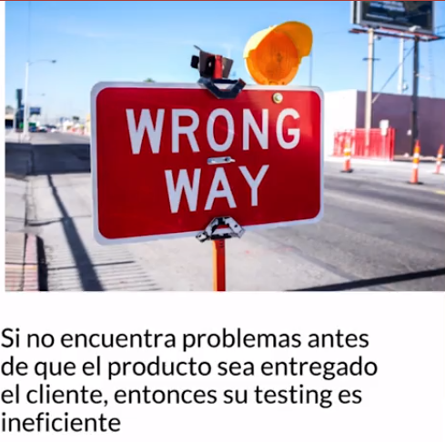
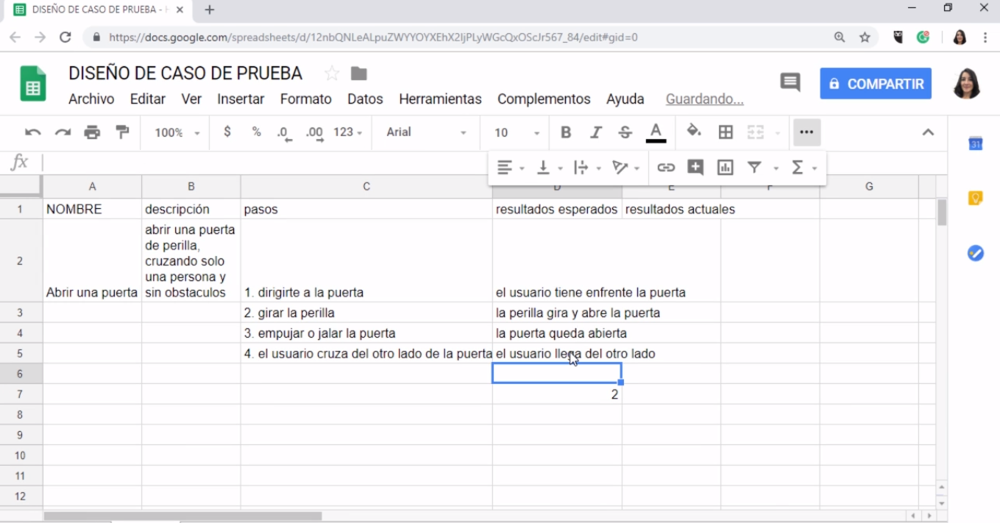

[🔙 << Clase 14](../14_Class/14_Class.md) | [Clase 16 >>](../16_Class/16_Class.md)

[🔙 Volver](../README.md)

## Clase 15 Definición y diseño de pruebas

### ¿Qué hace un tester?

1. Encontrar problemas

2. Documentar problemas

3. Comunicar problemas

Si cuando encuentra problemas no sabe documentar y reproducir los pasos correctos su testing genera retrabajo y sube el costo

Si como representate de la calidad del producto no sabe argumentar y proteger los intereses del negocioo los clientes, entonces su testing no agregar valor

### ¿Qué debe de contener un caso de prueba?

Debe tener:

- nombre: corta descripcion de lo que se va a realizar

- descripción: Explicación de que se trata la prueba

- pasos: Cada uno de los pasos de la prueba

- resultados esperados

- resultados actuales

🎉 CONGRATULATIONS ! 🎉

[🔙 << Clase 14](../14_Class/14_Class.md) | [Clase 16 >>](../16_Class/16_Class.md)

