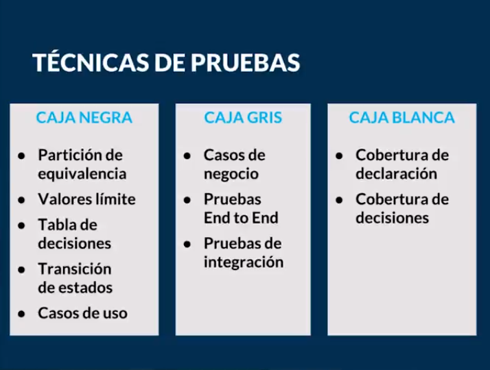

[🔙 << Clase 15](../15_Class/15_Class.md) | [Clase 17 >>](../17_Class/17_Class.md)

[🔙 Volver](../README.md)

## Clase 16 Caja Blanca, Gris y Negra

Se llaman pruebas de caja porque es la manera de observar el contenido del software.

Los modelos de caja negra es cuando por ejemplo en un computador no vemos como fue construido, se puede referenciar dentro del desarrollo como la parte del Backend, el codigo, no sabemos de arquitectura, si no la unica noción que tenemos es la interfaz con la que interactua el usuario

### Pruebas de caja negra

- **Partición de equivalencia:** Que tipo de informacion dentro de los tipos de datos deberia contener por ejemplo un formulario, enteros, flotantes

- **Valores límite:** Establecer limites por ejemplo un maximo de digitos en una fraccion en pesos.
    Que pasa si coloco una fraccion de 90.001 o 90.000.001 o 90.000.00001

- **Tabla de decisiones:** Aplica para casos donde existen check box o listas y son valores fijos, no le corresponde la opcion de establecer un criterio a los usuarios

- **Transición de estados:** Como el componente se comporta 

- **Casos de usos:** Por ejemplo donde un usario puede llenar un formulario y enviarlo o los campos son obligatorios y no puede pasar al siguiente campo hasta no completar los que son obligatorios

Los modelos de caja blanca es llamada en ocasiones caja de cristal, se puede referenciar dentro del desarrollo como la parte del Frontend, donde se puede ver todo lo que hay adentro e incluso es posible ser parte del equipo que esta desarrollando software 

### Pruebas de caja blanca

- **Cobertura de declaración:** Es todo aquello que esta dentro del codigo y se pide hacer, es decir que cada linea de codigo realizada se ejecute por lo menos una vez, debe tener una cobertura medible por porcentaje

- **Cobertura de codigo:** Es eliminar todo tipo de codigo que sea innecesario en el producto o proyecto teniendo en cuenta:
    
    - Sentencias

    - Desiciones

    - Condiciones 

Los modelos de caja gris es donde se realizan integraciones, viene siendo un punto intermedio entre la caja blanca y la caja negra y podemos ver los datos como fluyen o se transmiten de un lugar a otro

### Pruebas de caja gris

- **Casos de negocios:** Como el usuario esta interactuando en el Frontend o la interfaz y como esta respondiendo el producto es decir todo lo que va al Backend, se transforma y de que forma regresa la informacion al Frontend de nuevo. Es decir datos de entrada y salida

- **Pruebas End-to-End:** Se refiere por ejemplo a la creacion de un usuario para una aplicacion pero no necesariamente se tiene que ver como quedo en la salida y posiblemente no se vea el resultado pero se visualiza en otro entorno

- **Pruebas de integración:** Es ver como se estan transmitiendo los datos del Frontend al Backend 

 🎉 CONGRATULATIONS ! 🎉 

[🔙 << Clase 15](../15_Class/15_Class.md) | [Clase 17 >>](../17_Class/17_Class.md)

