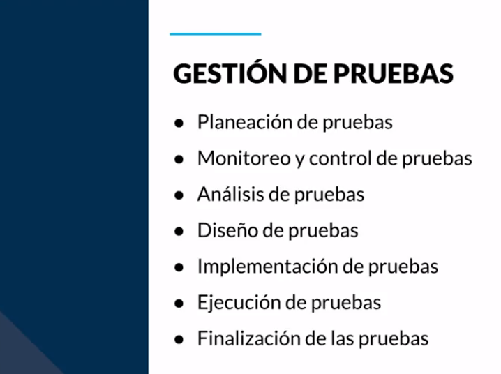
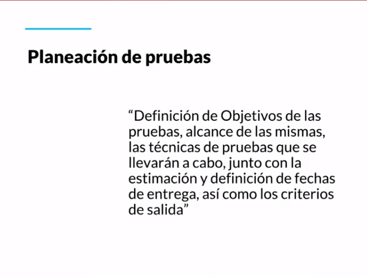
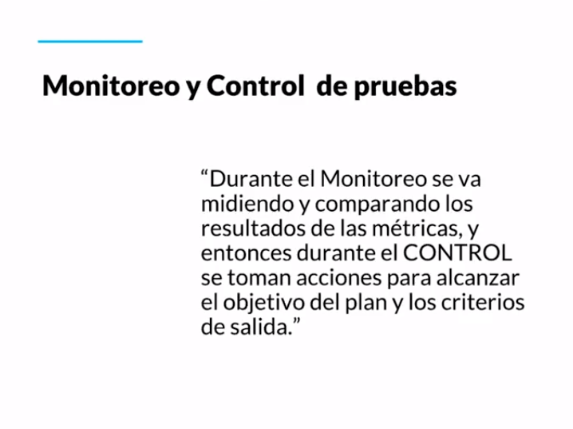
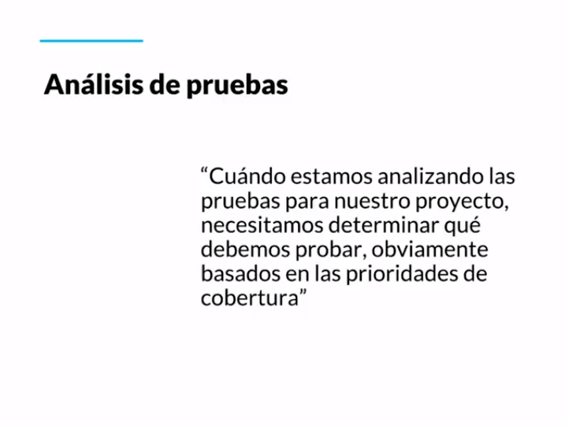
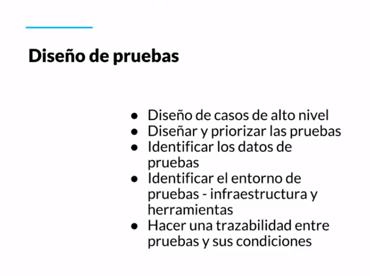
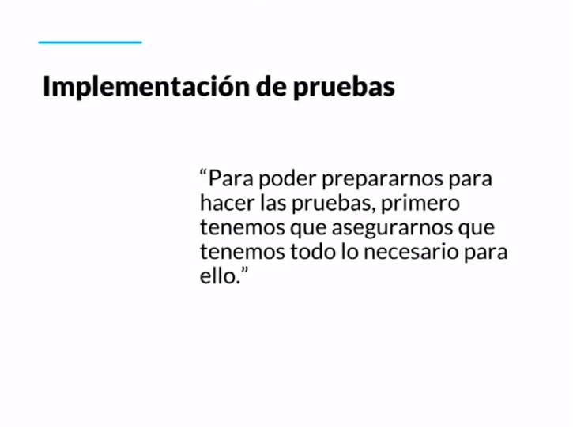
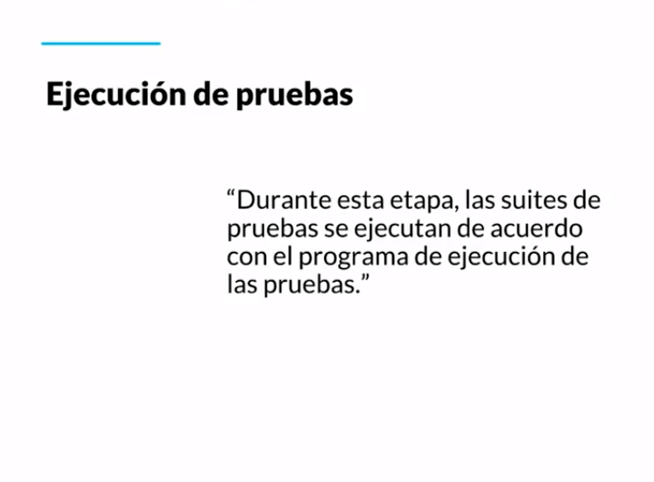
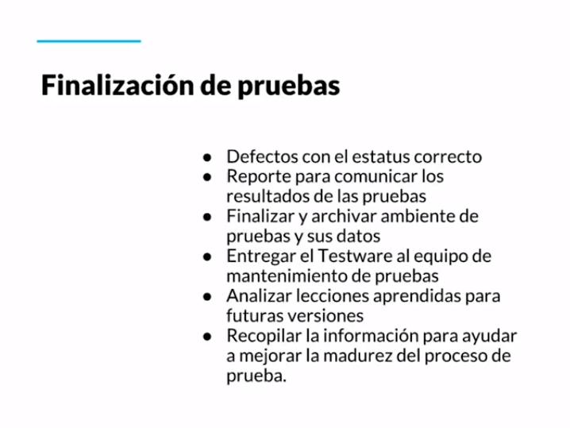

[🔙 << Clase 16](../16_Class/16_Class.md) | [Clase 18 >>](../18_Class/18_Class.md)

[🔙 Volver](../README.md)

## Clase 17 Gestión, monitoreo y control: Monitoreo y Seguimiento

### Planeacion de pruebas

- **Planeación:** Definir los objetivos de las pruebas es muy importante, al no tener una estrategia clara termina causando una pobre cobertura de pruebas. Los elementos a considerar para una buena planeación son la estimación, recursos, el alcance y objetivo.

- **Monitoreo y Control:** Durante el monitoreo lo que estamos buscando son esas métricas que nos digan si estamos llevando avances o tenemos retrasos. Son nuestras alertas cuando nuestro plan no se esta ejecutando.

- **Análisis:** Incluye decidir cuáles son esas prioridades que nos ayudará a definir qué debemos probar.

- **Diseño:** Normalmente cuándo estas iniciando las pruebas es necesario crear un mapa de ideas. Después de esto, puedes realizar el diseño a detalle de qué va a incluir cada caso de uso. Casos de alto nivel, diseñar y priorizar pruebas, identificar el entorno de pruebas, hacer una trazabilidad entre pruebas y sus condiciones.

- **Implementación:** También nos aseguramos de contar con la estructura necesaria para realizar las pruebas, con un ambiente, datos y dónde documentar o realizar las pruebas.

- **Ejecución:** En esta etapa los suites de pruebas se ejecutan de acuerdo al programa o el plan diseñado con anterioridad. Se suelen agrupar los casos de pruebas para que no estén desorganizado y podemos hacerles un buen seguimiento.

- **Finalización:** Cuando queremos cerrar el ciclo de las pruebas, necesitamos saber qué porcentaje se cubrió, ejecutó, cuántos defectos se derivaron, aprender lecciones sobre el proceso.

🎉 CONGRATULATIONS ! 🎉

[🔙 << Clase 16](../16_Class/16_Class.md) | [Clase 18 >>](../18_Class/18_Class.md)

