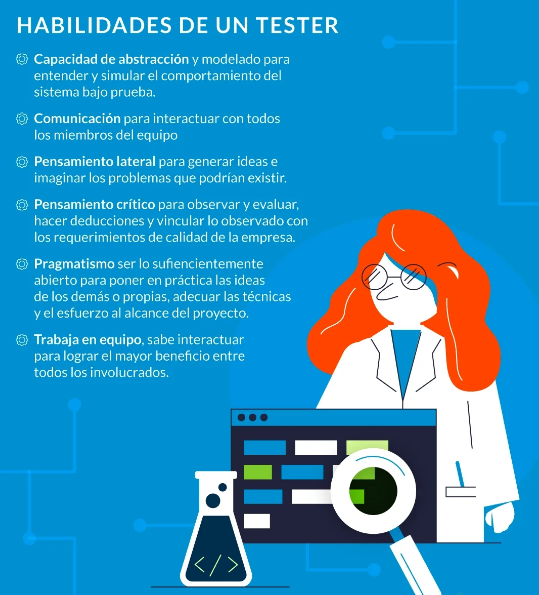

[🔙 << Clase 18](../18_Class/18_Class.md) | [Clase 20 >>](../20_Class/20_Class.md)

[🔙 Volver](../README.md)

# Clase 19 Roles y Responsabilidades en acción 

Independientemente del rol, un tester participa de todas las etapas del proceso de desarrollo de software, colaborando para asegurar la máxima calidad del producto. Su perfil conjuga un conjunto de habilidades con el conocimiento del negocio, de la aplicación bajo prueba y de cómo planificar, diseñar, ejecutar y administrar las pruebas.

“Un tester investiga un producto de software con el objetivo de obtener información acerca de su calidad y del valor que representa para quienes lo utilizan”

Cuando el esfuerzo en la calidad se enfoca y se distribuye en roles y responsabilidades podemos encontrar que la mayoría de las empresas manejan los siguientes roles:

**El tester manual**, se enfoca en la estrategia, definición, ejecución y cobertura de pruebas para cumplir los requerimientos, echando mano de cualquier técnica para obtener información suficiente y así cumplir con las asignaciones correspondientes.

**El tester técnico**, trabaja muy de cerca con el tester manual, mientras que el tester manual define las pruebas, el tester técnico acelera la capacidad de ejecución de las pruebas. Esto lo hace implementando herramientas que permitan la automatización de pruebas, o la correcta selección de datos de pruebas, o el monitoreo de la ejecución de las pruebas.

**El líder de pruebas**, generalmente dentro de sus responsabilidad es volverse un facilitador de servicios, información y herramientas para el equipo de pruebas, para poder estimar presupuestos, recursos y tiempos respecto al plan de desarrollo de software.

**El Ingeniero de calidad**, ya no solamente está al pendiente del producto y los procesos, comienza a involucrarse más con el negocio, ayudando tanto a testers como cualquier otro miembro del equipo a llevar cabo pruebas que reduzcan, en todas las etapas del ciclo de vida del software, el error humano.

🎉 CONGRATULATIONS ! 🎉

[🔙 << Clase 18](../18_Class/18_Class.md) | [Clase 20 >>](../20_Class/20_Class.md)

