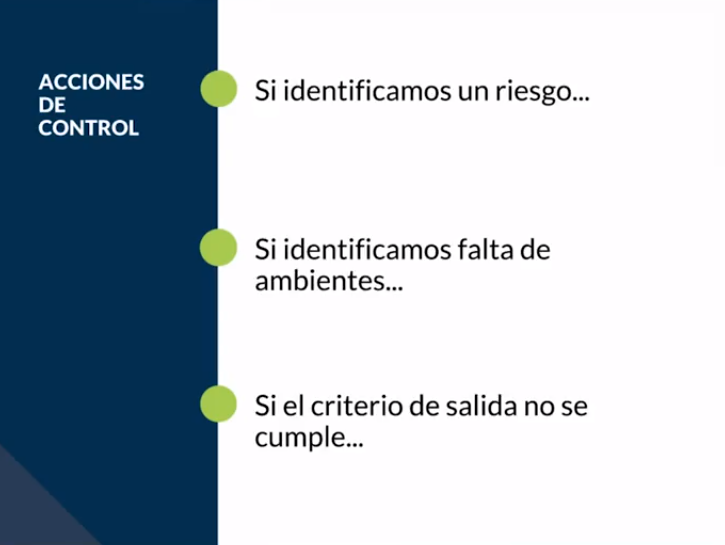
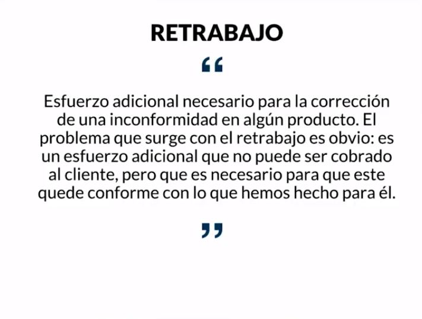

[🔙 << Clase 20](../20_Class/20_Class.md) | [Clase 22 >>](../22_Class/22_Class.md)

[🔙 Volver](../README.md)

# Clase 21 Retrabajo 

Es necesario identificar cada uno de los roles y responsabilidades para después evaluar si se esta haciendo o no re trabajo, es decir estamos utilizando tiempo que podría ser utilizado en otras actividades o sencillamente que no debería hacerse

También es necesario medir el rendimiento de nuestro trabajo y herramientas que nos permitan conocer paso a paso cómo vamos avanzado en el proceso de manera individual o en equipo.

Otra forma es analizando los resultados de las pruebas. Es ver cuantas de ellas se han ejecutado, cuantas no han pasado, cuantas derivaron defectos o que no le permitio continuar el traajo.

El desempeño del testing, Que circunstancias permiten o no realizar el trabajo, como por ejemplo el que una persona no vaya un dia al trabajo, el cliente no entregue alguna especificacion, el equipo no es adecuado, se fue el internet.

**¿Cuando sucede el retrabajo?**

**Retrabajo:** Es la principal causa del retraso, de que la estimación de tiempo falle, de que costos suban. Cuando estos suceden aumentamos exponencialmente el trabajo de todos

- Falta o mala documentación

- Falta de capacitación o dominio en las herramientas utilizadas

- Falta de capacitación o dominio en el software a desarrollar

- Falta de comunicación

**Herramienta Diagrama de Gantt**

https://www.easyredmine.com/

🎉 CONGRATULATIONS ! 🎉

[🔙 << Clase 20](../20_Class/20_Class.md) | [Clase 22 >>](../22_Class/22_Class.md)

