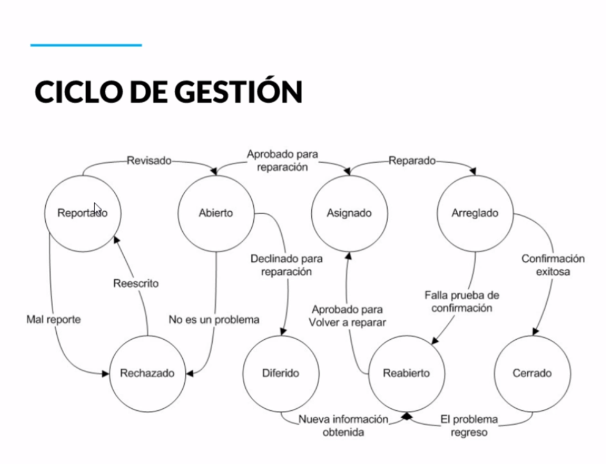

[🔙 << Clase 21](../21_Class/21_Class.md) | [Clase 23 >>](../23_Class/23_Class.md)

[🔙 Volver](../README.md)

# Clase 22 Sistema de seguimiento de bugs

La mala administración, malas prácticas o falta de seguimiento entorpece las tareas de todo el equipo sino que además si sumamos el retrabajo en la mala documentación puede que nuestro proyecto se salga de presupuesto o tiempo.

**Razones por las que aparecen defectos:**

- Hay presión de tiempo en la entrega del software

- Descuidos en el diseño

- Inexperiencia o falta de conocimiento

- Falta de comunicación en los requerimientos

- Diseño complejo de código

- Desconocimiento de las tecnologías usadas

**Preguntas a realizar para construir un proceso de gestión de bugs:**

- ¿Qué debe de hacer la persona que encuentre el defecto?

- ¿En qué herramienta debe documentar el defecto?

- ¿Cómo vamos a almacenar la información?

- ¿Qué información requiere el equipo de desarrollo para poder resolver un defecto?

- ¿Cuáles son los estatus que se manejan para que fluya la resolución del defecto?

- ¿Cuáles son los criterios de aceptación de cierre del defecto?

- El ciclo de gestion comienza con el reporte, es revisado y se considera en estatus abierto porque aun no ha sido resuelto

- Una vez se define que se va a reparar se asigna un desarrollador para atender el caso

- Cuando se repara el estatus pasa a arreglado

- Si la confirmacion es exitosa se cierra el caso

- Si ocurre un defecto nuevamente pasa al ciclo de gestión nuevamente y dependiendo el caso se reescribe el reporte y se analiza si debe ser aceptado, rechazado o se puede tomar como una sugerencia, luego pasa a estatus reabierto y nuevamente se trabaja sobre la reparacion del reporte y posteriormente en caso que la confirmacion se exitosa, nuevamente se cierra el caso

Se debe tener en cuenta que la persona debe ser responsable y reportar o abrir nuevos casos o tickets para que se trabaje eficientemente en los cambios y no significa que se deba agregar algo mas de lo solicitado, si no unicamente trabajar en el reporte y comuunicar eficientemente los cambios para que sean revisados por el equipo o el lider del proceso

 🎉 CONGRATULATIONS ! 🎉 

[🔙 << Clase 21](../21_Class/21_Class.md) | [Clase 23 >>](../23_Class/23_Class.md)

