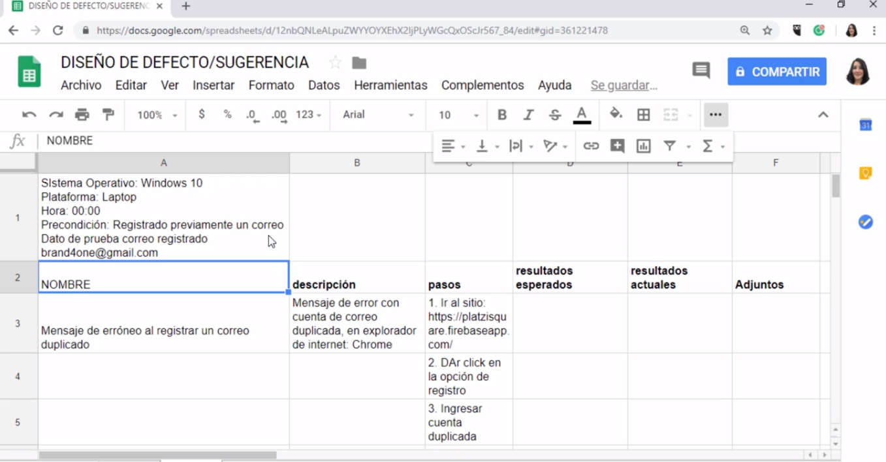

[🔙 << Clase 22](../22_Class/22_Class.md) | [Clase 24 >>](../24_Class/24_Class.md)

[🔙 Volver](../README.md)

# Clase 23 Defectos y sugerencias

**Defectos**

Es aquello que no cumple los requerimientos funcionales, de diseño, arquitectura y es la consecuencia de un error humano o intepretacion con la cual se construyo un software

**Sugerencia**

Como la experiencia del usuario se ve afectada, colores, navegacion lenta, lenguaje, cultura etc.

**Cómo reportar un defecto/sugerencia**

para este caso se establece un ejemplo de un mensaje de error que le aparece a un usuario que se esta registrando y probablemente ya habia hecho un registro anterior pero el mensaje que le esta saliendo al usuario es erroneo y no es el esperado

Se debe tener la plantilla para realizar el reporte

En este caso se toma un Screenshot para ampliar la informacion que se esta comunicando

se pueden tomar datos de donde proviene la informacion que se esta reportando

Tambien se pueden añadir campos de ser necesarios a la plantilla de reporte para documentar el caso reportado

🎉 CONGRATULATIONS ! 🎉

[🔙 << Clase 22](../22_Class/22_Class.md) | [Clase 24 >>](../24_Class/24_Class.md)

