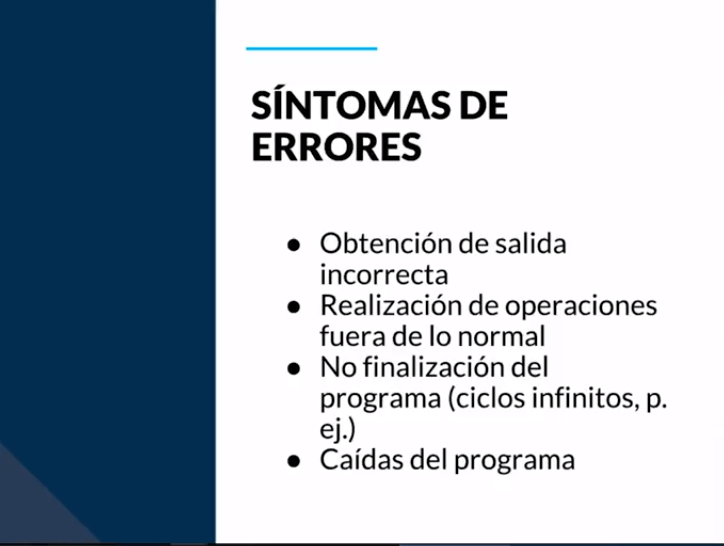
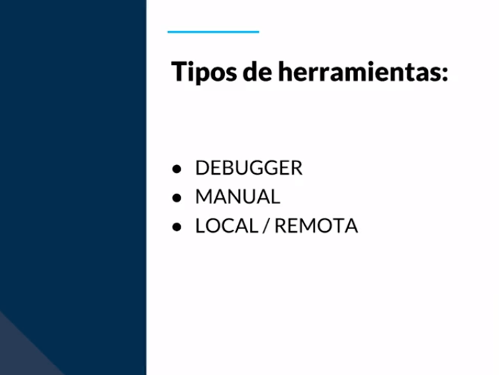

[🔙 << Clase 23](../23_Class/23_Class.md) | [Clase 25 >>](../25_Class/25_Class.md)

[🔙 Volver](../README.md)

# Clase 24 ¿Qué es la depuración?

Hacer testing o depuración son dos actividades diferentes. Mientras el testing sirven para encontrar defectos, la depuración nos permitirá entender por qué esta sucediendo este defecto y que actividades están implicadas en el. Ambas pueden ir de la mano y son muy importantes.

**Debugger:** Es una herramienta que nos ayuda a encontrar todos estos errores ya sea de sintaxis, advertencias de seguridad, etc. Nos permite ejecutar línea por línea, detener la ejecución temporalmente, visualizar el contenido de las variables, cambiar el valor del entorno de ejecución para poder ver el efecto de una corrección en el programa.

### Beneficiados

- **Programador:** Requiere cada vez que programa ir depurando lo que ejecuta y escriba para que cumpla con su objetivo

- **Tester:** Le ayuda a reducir el tiempo de análisis que después puede ser asignado para el desarrollador

- **Analista:** Puede ser para analisis de encontrar información de un historial sobre cómo se comporta un sistema.

- **Objetivo:** Vamos a analizar cómo se comporta el sistema, cómo se transfieren los datos, cómo se procesa la información. Tenemos la capacidad de tener nuestro código en cualquier momento para conocer cómo funciona.

### Errores

Aunque se realice depuración existe probabilidad de encontrar defectos

se deben observar:

- Mensajes de advertencia

- Estándares de compilación

- Verificación sintáctica y lógica

🎉 CONGRATULATIONS ! 🎉

[🔙 << Clase 23](../23_Class/23_Class.md) | [Clase 25 >>](../25_Class/25_Class.md)

