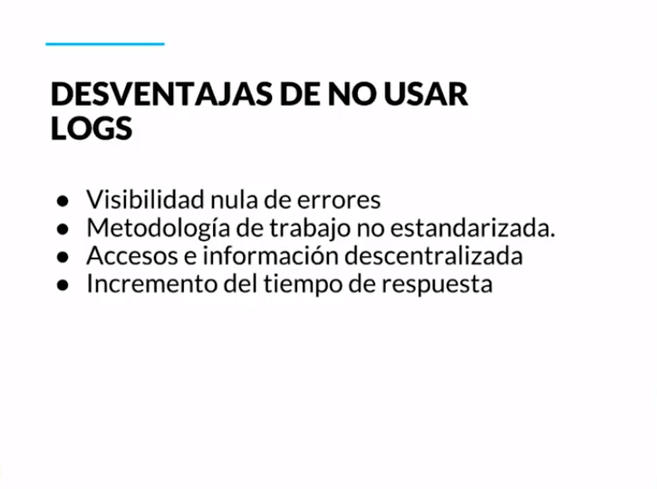
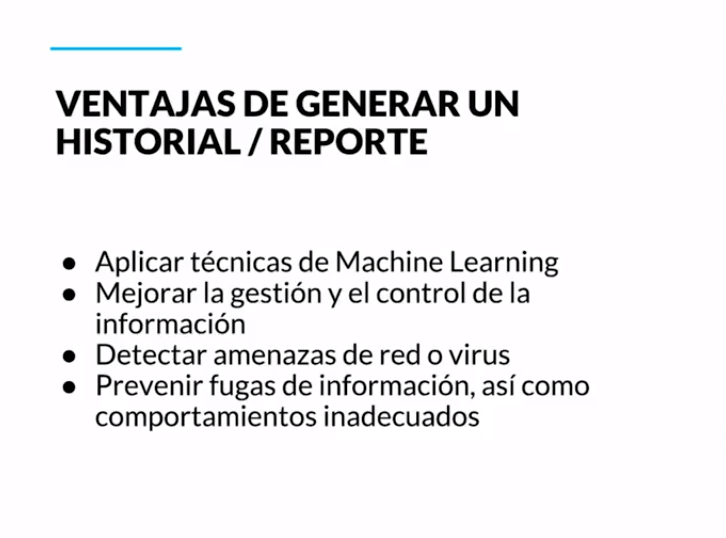

[🔙 << Clase 24](../24_Class/24_Class.md) | [Clase 26 >>](../26_Class/26_Class.md)

[🔙 Volver](../README.md)

# Clase 25 Técnicas de depuración

Deben ir cambiando de ser reactivas a ser preventivas. Si ya podemos observar a través de estas herramientas cómo se está utilizando la información, hacia dónde viaja, quién responde, deberíamos también recordar que parte de los principios del testing moderno es tratar de ir corrigiendo nuestras técnicas, implementar mejores prácticas y hacer uso de mejores herramientas. El debugging debería de ser la última alternativa.

**Técnicas de depuración:**

- **Debugging:** Observar valores de variables, detener temporalmente la aplicación.

- **Logs:** Hacer un vaciado de cómo las variables van cambiando y es más fácil rastrear la información.

- **Historial:** Agiliza la forma de monitorear y observar los comportamientos de nuestro software. - Comparando valores, agrupando información.

- **Reportes:** Observar anomalías, acelerar el tiempo de respuesta, prevenir ataques o fallas.

### Tenemos Fase 1 para encontrar el error y Fase2 para corregir el error

- **Fase 1: Pasos para depurar:**
    1. Ir al módulo que falla
    2. Establecer breakpoints:
        - En asignacion de valores
        - Procesamiento de valores
        - Cambio de estados
    3. Diseñar una matrix de pruebas
    4. Establecer los datos de prueba
    5. Comenzar a depurar

[🔙 << Clase 24](../24_Class/24_Class.md) | [Clase 26 >>](../26_Class/26_Class.md)

