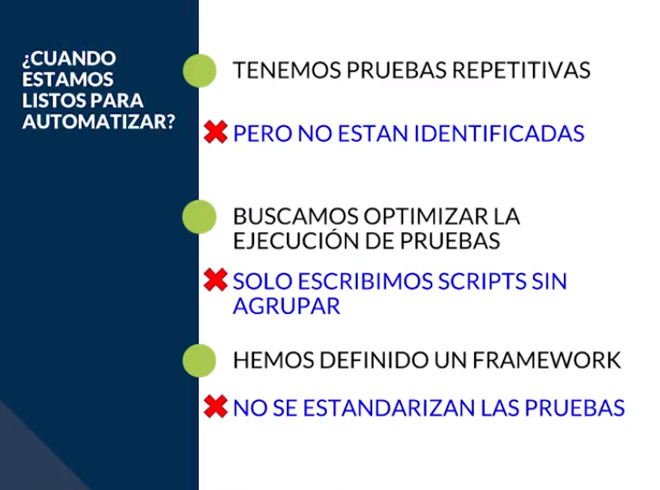
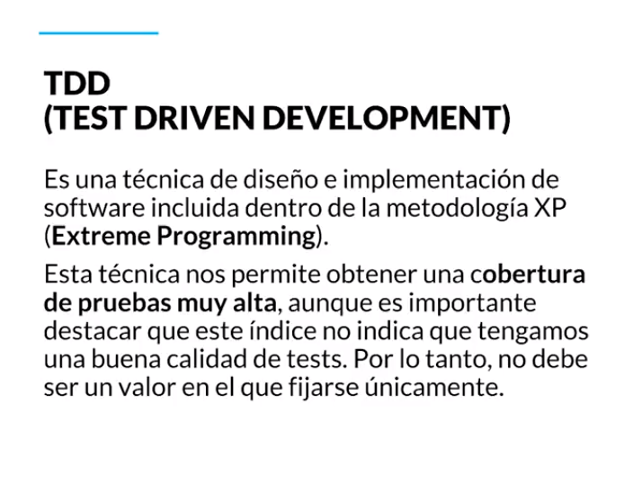
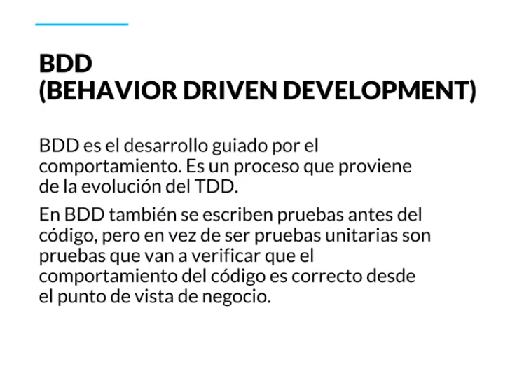
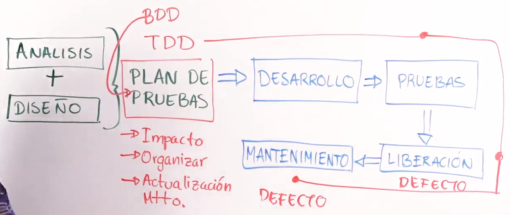

[🔙 << Clase 26](../26_Class/26_Class.md) | [Clase 28 >>](../28_Class/28_Class.md)

[🔙 Volver](../README.md)

# Clase 27 Base para Automatización de pruebas

En esta unidad vamos a conocer las bases para la automatización de pruebas y podemos automatizar las siguientes tipos de pruebas.

- **Pruebas unitarias:** Tienen que ver con un pedazo de código que el desarrollador esta codificando, pero no tienen que ver con todo el flujo de negocio y proceso del software.

- **Pruebas de integración:** Cómo hacemos que el conjunto del equipo que libera pedacitos de software funcionen juntos y no hagan defectos adicionales.

- **Pruebas funcionales o de aceptación:** Estas pruebas no necesariamente forman parte de los requerimientos especificados por el cliente, una recomendación para automatizar estas pruebas es que deban cumplir con los requerimientos dados por el cliente.

### Test Driven Development

El desarrollo va a estar enfocado haciendo primera las pruebas y después el código. Haciendo que el desarollo sea muy específico con la mayor cobertura y no pongamos líneas de código que no van a funcionar o no se usan.
- **Proceso TDD:** 
    1. Escribimos una prueba
    2. Ejecutamos la prueba: Falla
    3. Se escribe el código
    4. Ejecutamos la prueba: Pasa

### Behavior Driven Development:

Si primero vamos a escribir las pruebas, debemos hacerlo bien y usando un lenguaje sencillo, simple para que la sirva al equipo para entender qué es lo que queremos hacer.

**Entre mas claros los casos de prueba, mas eficiente la cobertura de pruebas. Entre menos errores o ambiguedad tengan los casos de pruebas, son mas facil de ejecturar o automatizar** 

[🔙 << Clase 26](../26_Class/26_Class.md) | [Clase 28 >>](../28_Class/28_Class.md)

