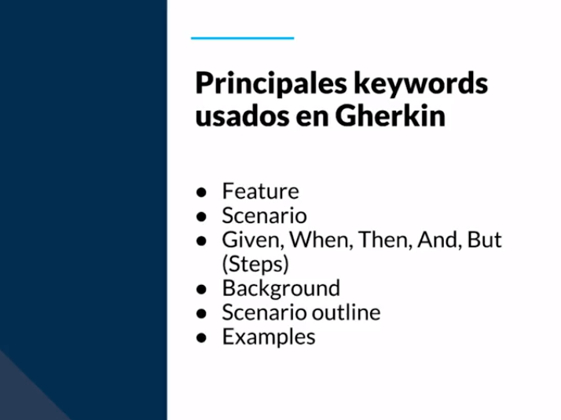

[🔙 << Clase 27](../27_Class/27_Class.md)

[🔙 Volver](../README.md)

# Clase 28 Gherkin

**Gherkin es un lenguaje de texto plano con estructura, usamos palabras que no son comandos pero permiten entender en un modo de pseudocódigo qué es lo que se tiene que hacer.**

**Esta diseñado para ser fácil de aprender y ser entendido por todos.**

- **Ventajas**
    - Simple
    - Palabras claves o keywords
    - Estandariza los casos de uso
    - Reduce el tiempo de diseño

**Ejemplo de uso de Gherkin**

[🔙 << Clase 27](../27_Class/27_Class.md)

