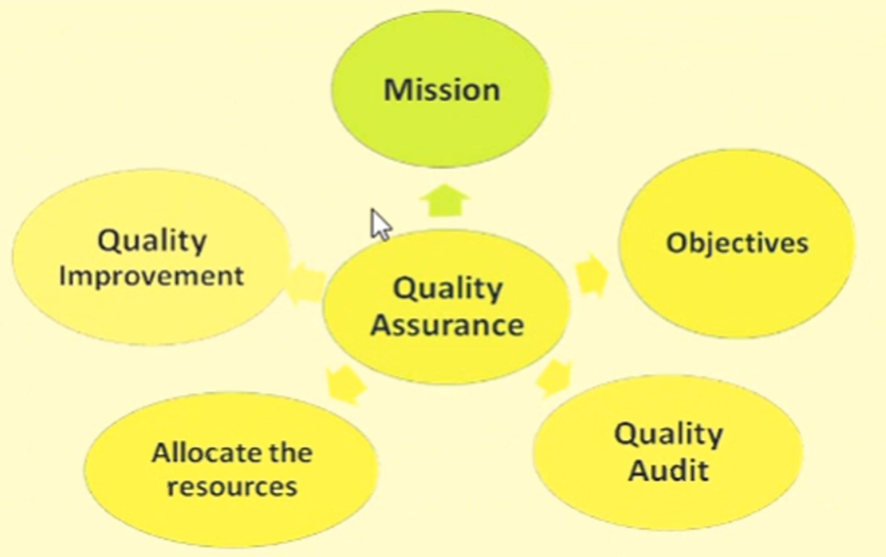
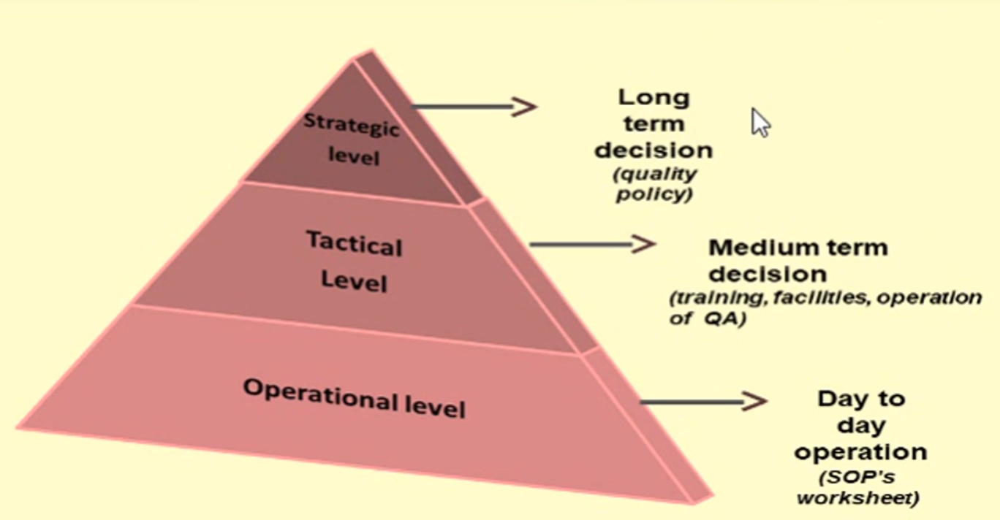
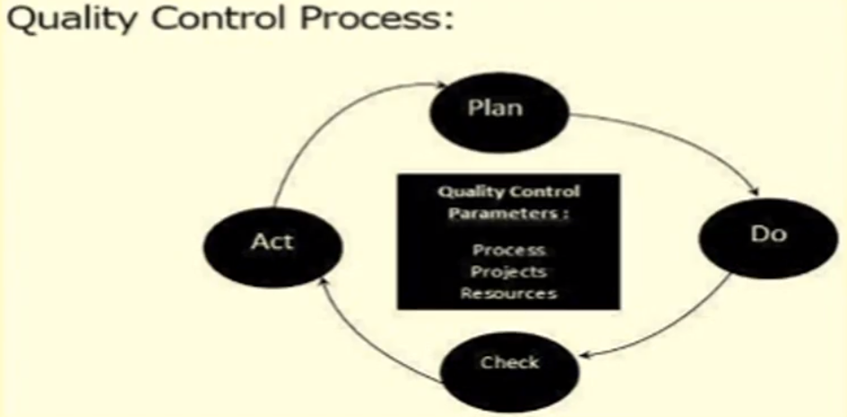
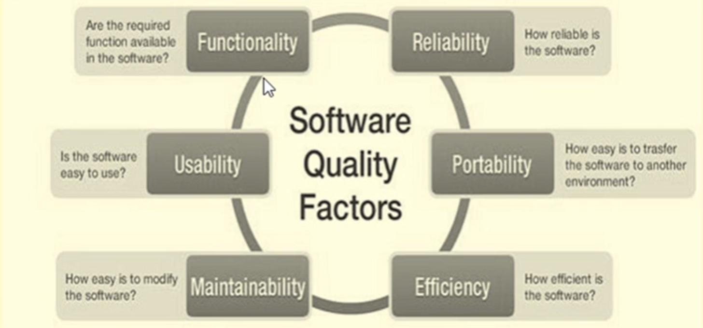

[🔙 << Clase 1](../01_Class_Introduction/01_Introduction.md) | [Clase 3 >>](../03_Class/03_Class.md)

[🔙 Volver](../README.md)

# Performance Testing Life Cycle

## 1. Requirements / Gathering
### Purpose
- Performance testing requirements are identified.
- The gathered requirements are analyzed.
- Requirements are documented in NFR document.
- NFR document is signed off.

### Approach
- Client wants to do performance testing.
- Stakeholders approaches performance test team.
- Test Manager/ Test Lead conducts meetings with stakeholders and/or client.
- After through review, these requirements are documented.

### Example NFR's for E-commerce Store:
- Site should support 50 concurrent users.
- Browse pages (Eg. Product Category, Product Details) should not take more than 2 seconds
- Search pages (Eg. Search Results, Filter, Sort) should not take more than 3 seconds.
- Cart Checkout pages (Eg. Add to Cart, Proceed to Checkout, Payment) should not take more than 2 seconds.
- All other pages (Eg. Profile, My Orders) should not take more than 4 seconds.
- Error rate should be less than 2%.
- Server CPU utilization should not exceed 70%.
- Server Memory utilization should not exceed 60%
- Optional: During some days, site receives more traffic. Account for that too.

### Challenges
- Vague requirements.
    - Ask questions.
    - Go through historical usage patterns.
    - if application is new, use step-up approach.
- Lot of co-ordination between different teams.

## 2. Perfomance Test Planning

### Purpose
- Detailed performance test strategy and plan is prepared
- All these details are captured in performance test plan document.
- Performance test plan is signed off.

### Approach
- Overall performance testing activities are planned and documented as Performance Test Plan by Test Manager or Test Lead.
- This test plan will have details such as:
    - Performance test scope.
    - Test entry and exit criteria.
    - Tooling and resourcing requirements.
    - Test Environment and test data.
    - Test execution strategy.
    - Any 3rd party dependencies.
    - Metrics that will be captured.
    - Risk identification and mitigation steps.
    - etc.
- The test plan is reviewed and approved by project team.

### Example NFR's for E-commerce Store:
- Site should support 50 concurrent users.
- Browse pages (Eg. Product Category, Product Details) should not take more than 2 seconds
- Search pages (Eg. Search Results, Filter, Sort) should not take more than 3 seconds.
- Cart Checkout pages (Eg. Add to Cart, Proceed to Checkout, Payment) should not take more than 2 seconds.
- All other pages (Eg. Profile, My Orders) should not take more than 4 seconds.
- Error rate should be less than 2%.
- Server CPU utilization should not exceed 70%.
- Server Memory utilization should not exceed 60%
- Optional: During some days, site receives more traffic. Account for that too.

### Challenges
- Vague requirements.
    - Ask questions.
    - Go through historical usage patterns.
    - if application is new, use step-up approach.
- Lot of co-ordination between different teams.

## Quality Management

Quality management involves coordinated activities to direct and control an organization with regard to quality. It consists of a management system (MS) that establishes policies and objectives to achieve those objectives. A quality management system (QMS) is specifically designed to direct and control an organization with regard to quality.

## Historical Development of Quality Management

The development of quality management can be traced through four stages:

1. Quality Inspection (QI)
2. Quality Control (QC)
3. Quality Assurance (QA)
4. Total Quality Management (TQM)

## Quality Assurance

Quality Assurance (QA) refers to planned and systematic activities implemented within a quality system to provide confidence that a product or service will fulfill quality requirements. It involves evaluating the performance and service quality of a product against specified requirements for customers. Quality assurance includes planned activities and a systematic approach to ensure adequate confidence in product and service quality. It encompasses mission, objectives, quality improvement, quality audit, and resource allocation.

## What is Quality Assurance? 

## Components of Quality Assurance

## Activities of Quality Assurance

## Software Quality Assurance

Software Quality Assurance (SQA) comprises a set of activities that ensure quality in software engineering processes, ultimately resulting in quality software products. SQA focuses on process-oriented activities that aim to assess and evaluate the processes that produce software products.

## Quality Control

Quality control is a set of methods used by organizations to achieve quality parameters or goals and continually improve the organization's ability to ensure that a software product meets quality requirements. It involves reviewing and testing phases of the software development life cycle to ensure that products meet specifications and requirements.

## Software Quality Control

Software Quality Control (SQC) is a set of activities that ensure quality in software products. SQC is primarily focused on the review and testing phases of the software development life cycle. The goal of SQC is to ensure that software products meet specified requirements.

## Software Quality Factors

---

[🔙 << Clase 1](../01_Class_Introduction/01_Introduction.md) | [Clase 3 >>](../03_Class/03_Class.md)
