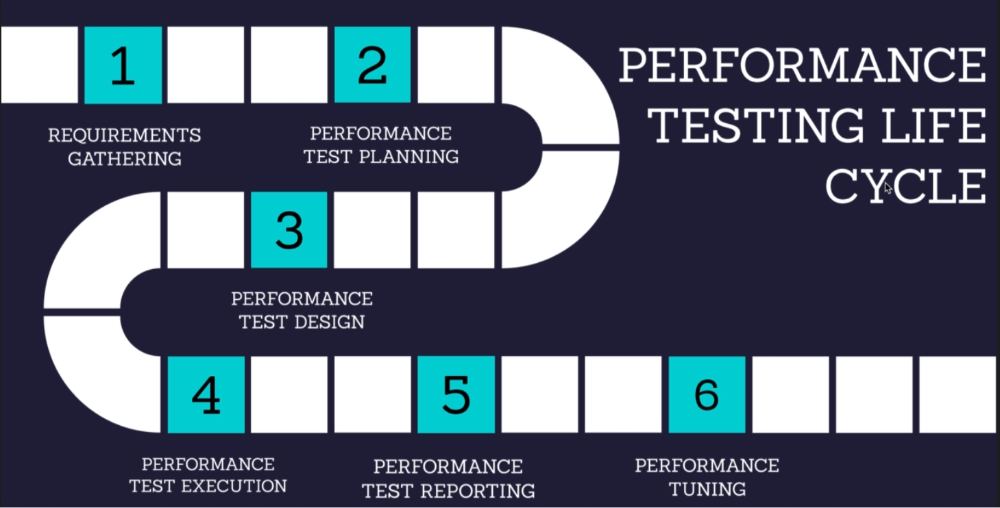

[🔙 << Clase 1](../01_Class_Introduction/01_Introduction.md) | [Clase 3 >>](../03_Class/03_Class.md)

[🔙 Volver](../README.md)

# Performance Testing Life Cycle

## 1. Requirements / Gathering
### Purpose
- Performance testing requirements are identified.
- The gathered requirements are analyzed.
- Requirements are documented in NFR document.
- NFR document is signed off.

### Approach
- Client wants to do performance testing.
- Stakeholders approaches performance test team.
- Test Manager/ Test Lead conducts meetings with stakeholders and/or client.
- After through review, these requirements are documented.

### Example NFR's for E-commerce Store:
- Site should support 50 concurrent users.
- Browse pages (Eg. Product Category, Product Details) should not take more than 2 seconds
- Search pages (Eg. Search Results, Filter, Sort) should not take more than 3 seconds.
- Cart Checkout pages (Eg. Add to Cart, Proceed to Checkout, Payment) should not take more than 2 seconds.
- All other pages (Eg. Profile, My Orders) should not take more than 4 seconds.
- Error rate should be less than 2%.
- Server CPU utilization should not exceed 70%.
- Server Memory utilization should not exceed 60%
- Optional: During some days, site receives more traffic. Account for that too.

### Challenges
- Vague requirements.
    - Ask questions.
    - Go through historical usage patterns.
    - if application is new, use step-up approach.
- Lot of co-ordination between different teams.

## 2. Perfomance Test Planning

### Purpose
- Detailed performance test strategy and plan is prepared
- All these details are captured in performance test plan document.
- Performance test plan is signed off.

### Approach
- Overall performance testing activities are planned and documented as Performance Test Plan by Test Manager or Test Lead.
- This test plan will have details such as:
    - Performance test scope.
    - Test entry and exit criteria.
    - Tooling and resourcing requirements.
    - Test Environment and test data.
    - Test execution strategy.
    - Any 3rd party dependencies.
    - Metrics that will be captured.
    - Risk identification and mitigation steps.
    - etc.
- The test plan is reviewed and approved by project team.

### Example NFR's for E-commerce Store:
- Site should support 50 concurrent users.
- Browse pages (Eg. Product Category, Product Details) should not take more than 2 seconds
- Search pages (Eg. Search Results, Filter, Sort) should not take more than 3 seconds.
- Cart Checkout pages (Eg. Add to Cart, Proceed to Checkout, Payment) should not take more than 2 seconds.
- All other pages (Eg. Profile, My Orders) should not take more than 4 seconds.
- Error rate should be less than 2%.
- Server CPU utilization should not exceed 70%.
- Server Memory utilization should not exceed 60%
- Optional: During some days, site receives more traffic. Account for that too.

### Challenges
- Vague requirements.
    - Ask questions.
    - Go through historical usage patterns.
    - if application is new, use step-up approach.
- Lot of co-ordination between different teams.

## 3. Performance Test Design

### Purpose
- Creating performance test scripts as per test plan.
- Validating that the test scripts are working as intended.
- Get test scripts reviewed.

### Approach
- Test scripts are typically created by Performance Tester.
- They go through all scenarios documented in performance test plan.
- Test scripts are prepared based on the requirements.
    - Recording the test scripts.
    - Enhancing the test scripts by adding any custom logic, think time, assertions, etc to simulate a real world scenario.
    - Validating the scripts.
    - Scripts are debugged if they are not working as expected.
- Scripts are reviewed and verified by Test Manager or Test Lead.

### Challenges
- Unavailabity of performance test environment.
    - Try to make the script reusable.
    - Validate the script throughly on performance test environment.
- Unavailability of 3rd party services or required API's.
    - Mocking/service virtualization.

## 4. Performance Test Execution

### Purpose
- Run performance test.
- Analyze performance test results.
- Raise a defect in case any performance bottleneck is found.

### Approach
- Performance Tester run the script to generate load on the application.
    - Load generators are used.
    - Graphs and metric are monitored while test is running.
    - Application resource usage is also monitored.
- At the end of a test run, junk records are cleared.
- Metrics captured for test run are compared against the test plan.
- Defect is raised in case a performance bottleneck is found.
- Root cause analysis is performed by relevant team members.

## 5. Performance Test Reporting

### Purpose
- Prepare a final performance test report.
- Provide a Go/No-go decision.
- Provide performance recommendations.
- Bring an attention to any performance related risks.

### Approach
- Test Manager or Test Lead prepares final performance test report with the help of Performance Testers.
- The document contains:
    - Details on whether all the NFR's are met in performance testing.
    - Issued noticed during performance testing.
    - Performance related risks
    - Recommendations to improve application performance.
- The report is then presented to stakeholders and/or client with Go/No-go decision.

## 6. Performance Tunning
- Performance tuning may be carried out on the application based on the recommendations in performance test report.
- These can be application specific or infra specific.
- If required, performance tests are run again to check if there is an improvement in
performance.

[🔙 << Clase 1](../01_Class_Introduction/01_Introduction.md) | [Clase 3 >>](../03_Class/03_Class.md)

