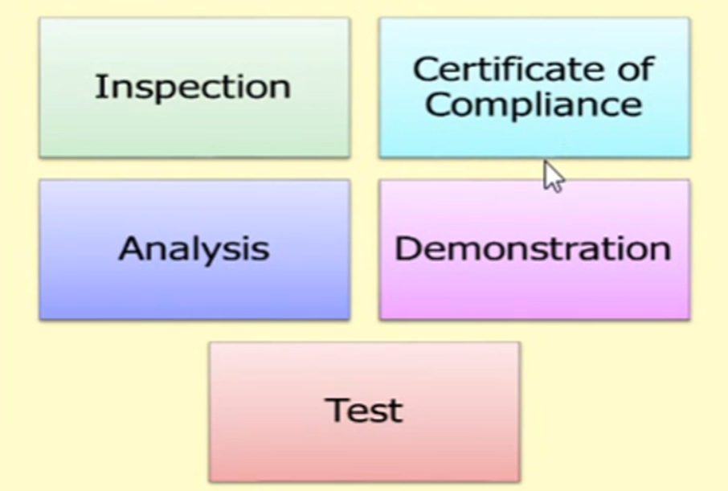
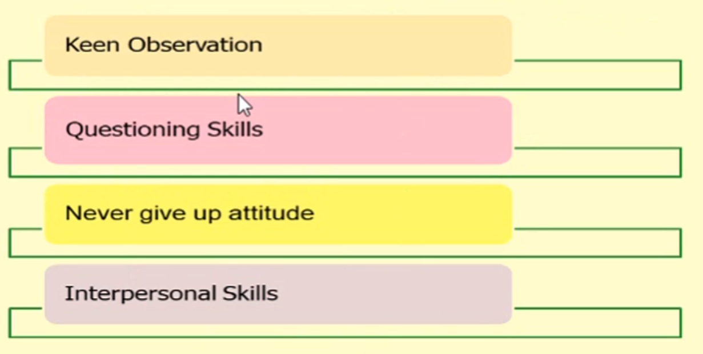

[🔙 << Clase 2](../02_Class/02_Class.md) | [Clase 4 >>](../04_Class/04_Class.md)

[🔙 Volver](../README.md)

# Performance BottleNeck

## What is BottleNeck?
A bottleneck occurs when the capacity of an application or a computer system is limited by a single component, like the neck of a bottle slowing down the overall water flow.
  - Performance degradation of application due to one or more of application components.
  - This can happen under certain load conditions.
  - Performance bottlenecks causes:
    - Slower response time
    - Unexpected application behavior
    - Increase error rate
## Examples
- App server supports 500 connections but database server supports only 10 connections.
  - in this case, database server can become a performance bottleneck.
- Your application supports 100 concurrent users load.
- the third party API that your application uses supports 20 concurrent users load.
  - in this case, the third party API can become a performance bottleneck.

## What Causes Performance BottleNeck?
- Insufficient hardware resources.
- Software configuration issues.
- Poorly written code.
- Unoptimided databases.
- Third party services.

## Tracking Performance BottleNecks

- Tracking performance bottleneck is known as Performance Analysis or BottleNeck Analysis
- APM (Application Performance Management) tools  
  - AppDynamics
  - New Relic
  - Dynatrace etc.

- Profiling tools
  - JConsole
  - JProfiler
  - VisualVM etc.

## Purpose of Software Testing

The goal of a software tester is:
- To find bugs.
- To find them as early as possible.
- To ensure they get fixed.

Testing is a means to:
- Find bugs.
- Provide confidence and information.
- Even prevent defects.

## What Methods are used to conduct testing?

There are five basic verification methods, as outlined below:

## Who makes a good tester?

A tester's mindset must have the following attributes:

## Testing Profession

Key aspects of the testing profession:

- Fun to break code.
- Rewarded for finding faults.
- Strong Domain Expertise / Business knowledge.
- Market Trend - Buy vs Build.
- Automation - Paves the way for being involved in all phases of SDLC.
- Competency Development - Test Architects / Consultants.
- "Sure Fire" Career path.

## Principles of software testing

1. Testing shows the presence of defects.
2. Exhaustive testing is impossible.
3. Early testing.
4. Defect Clustering.
5. Pesticide Paradox.
6. Testing is context-dependent.
7. Absence of error - fallacy.

[🔙 << Clase 2](../02_Class/02_Class.md) | [Clase 4 >>](../04_Class/04_Class.md)
