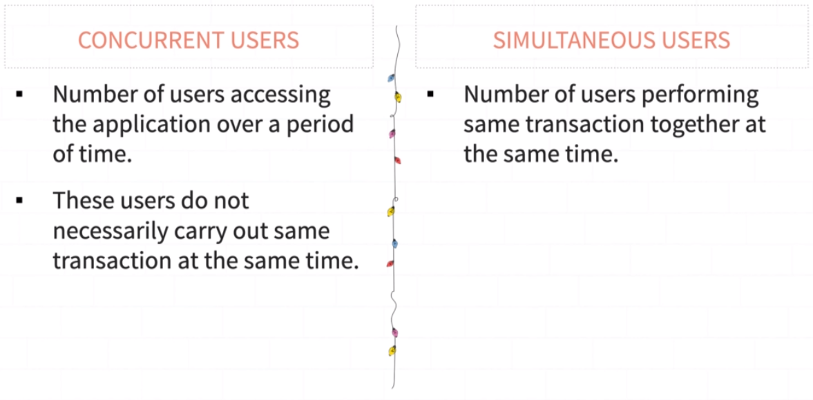

[🔙 << Clase 3](../03_Class/03_Class.md) | [Clase 5 >>](../05_Class/05_Class.md)

[🔙 Volver](../README.md)

# Concurrent Users and Simultaneous Users

## The Difference

## Concurrer Users Example

## Simultaneous Users Example

[🔙 << Clase 3](../03_Class/03_Class.md) | [Clase 5 >>](../05_Class/05_Class.md)
