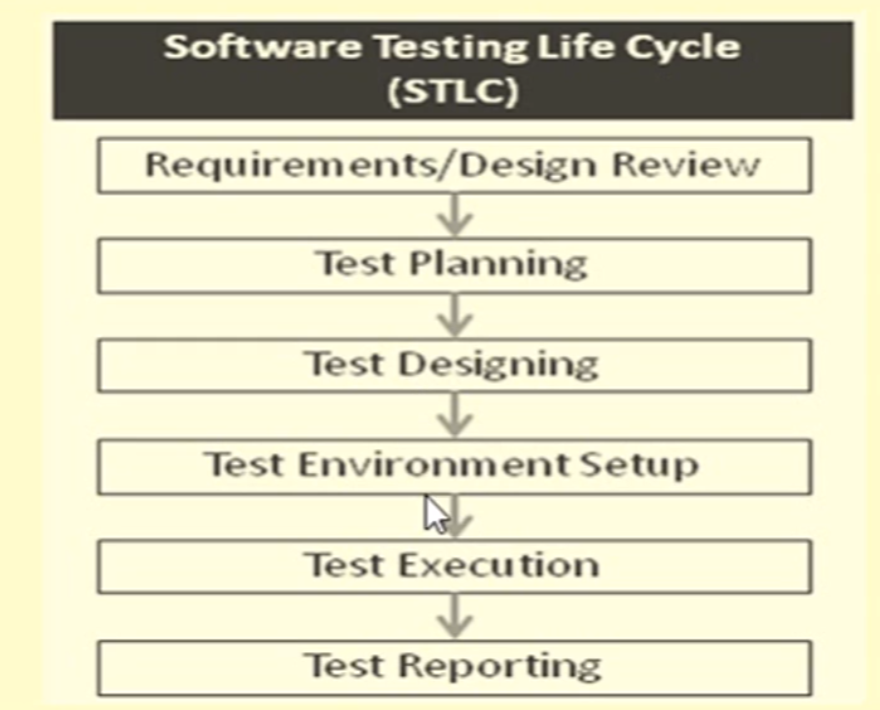
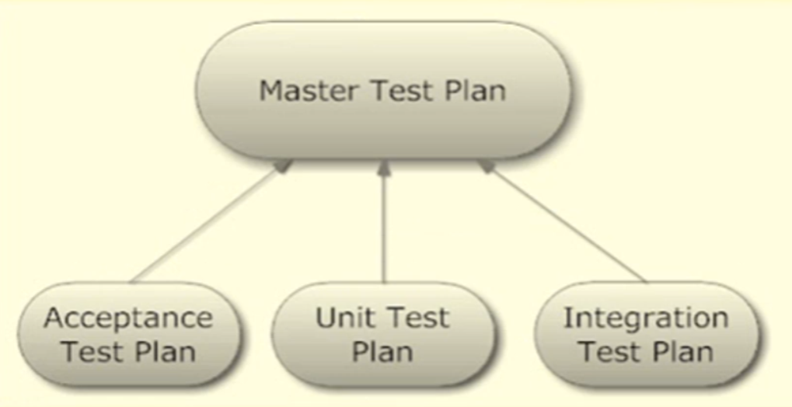

[🔙 << Clase 3](../03_Class/03_Class.md) | [Clase 5 >>](../05_Class/05_Class.md)

[🔙 Volver](../README.md)

# Test Administration - Test Plan and Test Cases

## Software Testing Life Cycle

## Test Plan
- Software testing is a formal process carried the scope, approach, resources and schedule of intended test activities.
- Why do we need to plan for it?
    - Testing is a complex process
    - Test planning is essential in:
        - ensuring testing identifies and reveals as many errors in the software as possible
        - bringing software to an acceptable level of quality
        - giving efficiency regarding budgetary and scheduling limitations
- IEEE Standard for Software Test Documentation dedines Test Planning as " a document describing the scope, approach, resources and schedule of intended testing activities"

## Levels of Test Plan

## Test Plan Document
Test Plans follow a strict strutture to ensure all aspects of testing are covered. This is stated by the ANSI/IEEE 829-1988 Test Plan Structure:

|         Test Plan Contents           |                                      |
|--------------------------------------|--------------------------------------|
| 1. Plan Identifier                   | 11. Test Deliverables                |
| 2. References                        | 12. Remaining Test Tasks             |
| 3. Introduction                      | 13. Environmental Requirements       |
| 4. Test Items                        | 14. Staffing/Training Needs          |
| 5. Risk Issues                       | 15. Responsibilities                 |
| 6. Features to be Tested             | 16. Schedule of Test                 |
| 7. Features not to be Tested         | 17. Planning for risks               |
| 8. Test Approach                     | 18. Approvals                        |
| 9. Pass/Fail Criteria                | 19. Glossary                         |
| 10. Suspension Criteria              |                                      |

## Test Cases
- A TEST CASE is a set of conditions or variables under which a tester
will determine whether a system under test satisfies requirements or
works correctly. The process of developing test cases can also help
find problems in the requirements or design of an application

- A test case is a document, which has a set of test data, preconditions,
expected results and postconditions, developed for a particular test
scenario in order to verify compliance against a specific requirement

- Test Case acts as the starting point for the test execution, and after
applying a set of input values, the application has a definitive outco}
and leaves the system at some end point or also known as execution p|
condition

[🔙 << Clase 3](../03_Class/03_Class.md) | [Clase 5 >>](../05_Class/05_Class.md)