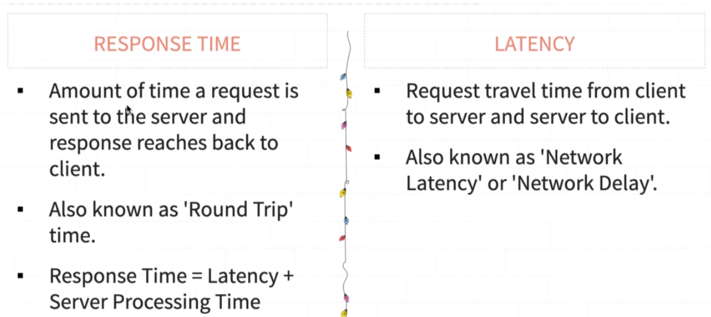

[🔙 << Clase 5](../05_Class/05_Class.md) | [Clase 7 >>](../07_Class/07_Class.md)

[🔙 Volver](../README.md) 

# Response Time, Latency and Throughput

           Client                        Server
     +--------+                        +--------+
     |        |      Request (1 sec)   |        |
     |        +------------------------>        |
     |        |                        |     Server Processing Time(2 sec)   
     |        |     Response (2 sec)   |        |
     |        <------------------------+        |
     |        |                        |        |
     +--------+                        +--------+
    Latency = 1 sec + 2 sec 
    Response Time = Latency + Server Processing Time 

## Throughput
- Number of transaction per unit of time an application handle.
- Generally denoted in a requests per second(RPS), transactions per seconds(TPS), hits per seconds,etc.
- Higher throughput = Good application performance.

[🔙 << Clase 5](../05_Class/05_Class.md) | [Clase 7 >>](../07_Class/07_Class.md)

