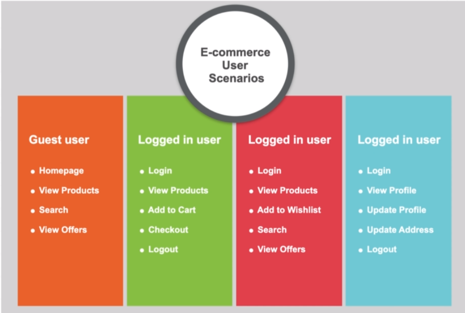

[🔙 << Clase 8](../08_Class/08_Class.md) | [Clase 10 >>](../10_Class/10_Class.md)

[🔙 Volver](../README.md) 

# Workload Modeling

## Workload in Performance Testing

## WLM of System

| Operation           | Expected Load in percentage |
|---------------------|----------------------------|
| HomePage            | 5%                         |
| Login               | 5%                         |
| Search              | 15%                        |
| View Offers         | 15%                        |
| View Products       | 40%                        |
| Add to Cart         | 7%                         |
| Checkout            | 3%                         |
| Add to Wishlist     | 5%                         |
| Profile Management  | 5%                         |

## Workload Modeling
- Distribution of load across identified test scenarios
- It depicts how application wil be used in production environment
- Typically done during planning phase
- Test scripts are prepared based on the workload modeling

[🔙 << Clase 8](../08_Class/08_Class.md) | [Clase 10 >>](../10_Class/10_Class.md)

