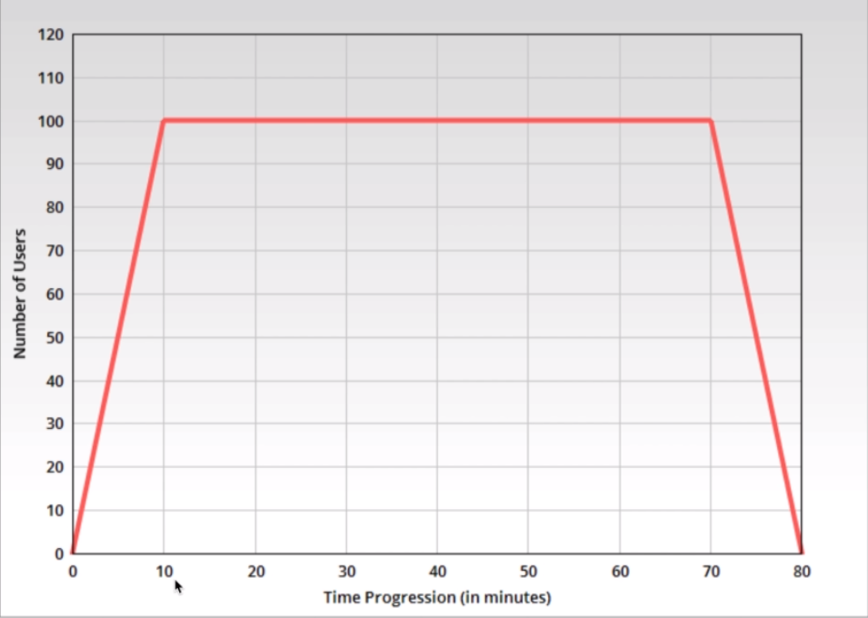

[🔙 << Clase 10](../10_Class/10_Class.md) | [Clase 12 >>](../12_Class/12_Class.md)

[🔙 Volver](../README.md)

# Load Test
## What is load test?
- Many confuse load test with performance test but they are not the same
    - Load test is a type of performance testing.
- Checking application performance under peak load conditions.
- Goal is to validate that a system can handle the expected load with acceptable performance.

## Load test approach (Planning)
- Load test NFR( Non Functional Requirements )are referred. The NRF's typically have details like
    - Expected response time
    - Peak load details
    - Users or TPS load
- Workload Model is prepared according to these NFR's

## Load test approach (Design & Execution)
- Load test scripts are prepared according to Workload Model.
- Load test is run for certain duration (1 or 2 hours)
    - Steady state (1 or 2 hours)
    - Ramp up and ramp down periods
- Metrics are measured during load test run
    - Response time
    - Errors
    - TPS
    - User Load
    - CPU and Memori utilization
- Errors or unexpected behavior are noted down

## Load test NFR's Example
| NFR ID| Requirement | Acceptance Criteria | Remarks |
|-------|-----------------|-----------------|-----------------|
| 1 | User Load | Application should be able to handle 100 concurrent users load|  |
| 2 | Response Time | Average response time of all the pages should be less than 2 seconds | 100th percentile should not be more than 4 seconds |
| 3 | Errors | Error rate should not exceed 3% |  |
| 4 | Transactions per second | 500 orders should be submitted in one hour |  |
| 5 | Resources utilization | CPU usage should not exceed 70% and memory usage should not exceed 80% | Applicable for web, app and DB servers |

## User Graph

## Common issues
- Slower response time
- Increased error rate after certain load
- Increased resource utilization
- One or more application components failing or misbehaving

[🔙 << Clase 10](../10_Class/10_Class.md) | [Clase 12 >>](../12_Class/12_Class.md)
