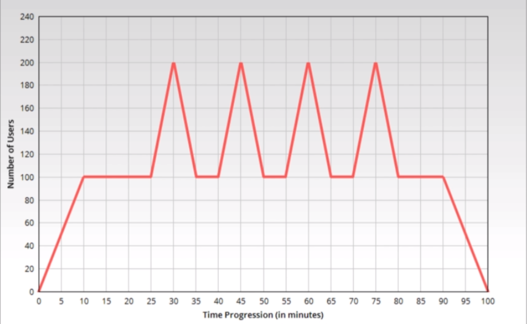
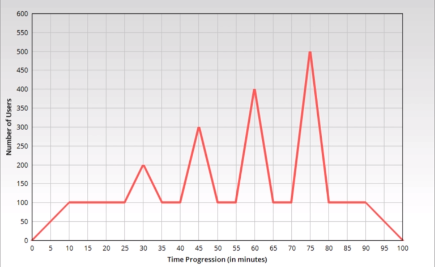
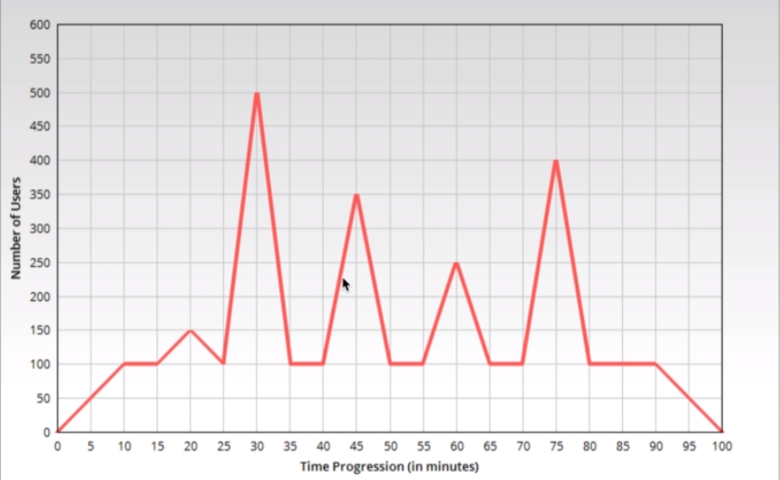

[🔙 << Clase 13](../13_Class/13_Class.md) 

[🔙 Volver](../README.md)

# Spike Test
## What is Spike Test?
- Checking the application performance in case of sudden increase in load
- Typically run for 1 or 2 hours, with spikes in load in-between
    - Spikes can be for short period (1-5 minutes) or relatively longer (10-15 minutes)
    - Also includes ramp up and ramp down periods
- Test starts with [average load](../05_Class/05_Class.md). Spike load is applied after steady state

## Average load & Spike Load
| Average Load | Spike Load|
|-------|-----------------|
| Average of all the load received during certain time period (Eg. Day, month, etc) | Sudden increase in load on the application due to some event (Eg. Flash sale, product unveiling, etc) |

## Spike test approach (Planning)
- Spike test NFR's are referred. The NFR's typically have details like
    - Expected response time
    - Average and spike load details
    - TPS load details
- Workload Model is prepared according to these NFR's

## Spike test approach (Design & Execution)
- Spike test scripts are prepared according to Workload Model
- Spike test is run for certain duration (1 or 2 hours)
    - 1 or 2 hours of steady state with short burst of spike load in-between
    - Ramp up and ramp down period
- Metrics are measured during spike test run
    - Response Time
    - Errors
    - CPU and memory utilization
- Errors or unexpected behavior are noted down

## Types of Spike Load
- Constat spike

- Step-up spike

- Random spike

## Spike test NFR's Example
| NFR ID| Requirement | Acceptance Criteria | Remarks |
|-------|-----------------|-----------------|-----------------|
| 1 | User Load | Application should be able to handle spike of 500 users load| Average load: 100 concurrent users |
| 2 | Response Time | Average response time of all the pages should be less than 3 seconds | 90th percentile should not be more than 4 seconds |
| 3 | Errors | Error rate should not exceed 2% | Error should be less than 4% during spike |
| 4 | Resources utilization | CPU usage should not exceed 90% and memory usage should not exceed 90% , application should remain stable | Applicable for web, app and DB servers |

## Common Issues
- Response time degradation
- Increase error rate
- Application crash
- One or more application components failing or misbehaving

[🔙 << Clase 13](../13_Class/13_Class.md) 
