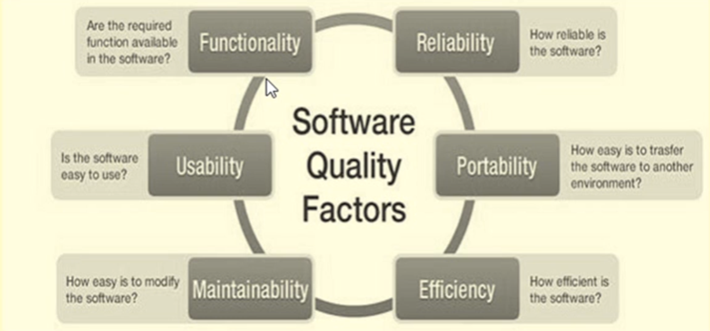

[🔙 << Clase 1](../01_Class_Introduction/01_Introduction.md) | [Clase 3 >>](../03_Class/03_Class.md)

[🔙 Volver](../README.md)

# Software Quality and SQA

## What is Quality?

Quality can be defined as the standard of something when measured against other similar things. It represents the degree of excellence or the relative nature and character of a product or service. Quality is determined by meeting the requirements and expectations of the customer.

## Attributes of Quality

Quality can be described using various attributes, such as beauty, goodness, freshness, and expensiveness. However, it's important to note that the use of attributes to describe quality is imprecise since different people perceive these attributes differently. Therefore, quality needs to be defined more precisely.

## Who Defines Quality - Q Lens

Quality can be defined through two lenses: the lens of the organization and the lens of the customer.

### Lens of the Organization

The organization defines quality by considering the perspectives of its people, products, and processes.

### Lens of the Customer

The customer defines quality based on the outcomes, results, and benefits they experience from a product or service.

## Performance Objectives of Quality

The performance objectives of quality can be summarized as follows:

- Competitiveness: 
    - Quality -> being right.
    - Speed: -> being fast.
    - Dependability: -> being on time.
    - Flexibility: -> being able to change.
    - Cost: -> being productive.

## Quality Management

Quality management involves coordinated activities to direct and control an organization with regard to quality. It consists of a management system (MS) that establishes policies and objectives to achieve those objectives. A quality management system (QMS) is specifically designed to direct and control an organization with regard to quality.

## Historical Development of Quality Management

The development of quality management can be traced through four stages:

1. Quality Inspection (QI)
2. Quality Control (QC)
3. Quality Assurance (QA)
4. Total Quality Management (TQM)

## Quality Assurance

Quality Assurance (QA) refers to planned and systematic activities implemented within a quality system to provide confidence that a product or service will fulfill quality requirements. It involves evaluating the performance and service quality of a product against specified requirements for customers. Quality assurance includes planned activities and a systematic approach to ensure adequate confidence in product and service quality. It encompasses mission, objectives, quality improvement, quality audit, and resource allocation.

## What is Quality Assurance? 

## Components of Quality Assurance

## Activities of Quality Assurance

## Software Quality Assurance

Software Quality Assurance (SQA) comprises a set of activities that ensure quality in software engineering processes, ultimately resulting in quality software products. SQA focuses on process-oriented activities that aim to assess and evaluate the processes that produce software products.

## Quality Control

Quality control is a set of methods used by organizations to achieve quality parameters or goals and continually improve the organization's ability to ensure that a software product meets quality requirements. It involves reviewing and testing phases of the software development life cycle to ensure that products meet specifications and requirements.

## Software Quality Control

Software Quality Control (SQC) is a set of activities that ensure quality in software products. SQC is primarily focused on the review and testing phases of the software development life cycle. The goal of SQC is to ensure that software products meet specified requirements.

## Software Quality Factors

---

[🔙 << Clase 1](../01_Class_Introduction/01_Introduction.md) | [Clase 3 >>](../03_Class/03_Class.md)
